

 

# Universidad Peruana de Ciencias Aplicadas
### Facultad de Ingeniería · Ciclo 2026-10

 

# Informe de Proyecto - Avance 1

## Startup: EcatLeasing

## Producto: PCPedia

 

**Código del Curso:** 1ASI0732 &nbsp;|&nbsp; **Nombre del Curso:** Diseño de Experimentos de Ingeniería de Software

**NRC:** `16880`

**Profesor:** Julio Manuel Noriega Melendez

 

### Integrantes

`U20231D390` - `Bendezu Navarro Rúbens`

`U20231c996` - `Hernandez Poma Sebastian Eduardo`

`U20191B935` - `Carranza Tesén Joaquín Enrique`

`U202311469` - `Arroyo Gonzales, Emily Juliette`

### **2026**

---

## Registro de Versiones del Informe

| Versión |   Fecha    |                                                                                Participantes                                                                                 | Descripción de modificación |
|:-------:|:----------:|:----------------------------------------------------------------------------------------------------------------------------------------------------------------------------:|:---------------------------|
| AV1 | 2026-05-02 | Bendezu Navarro, Rúbens   Hernandez Poma, Sebastian Eduardo   Carranza Tesén, Joaquín Enrique   Arroyo Gonzales, Emily Juliette  | || |            |                                                                                                                                                                              | |

---

## Project Report Collaboration Insights

**URL del Repositorio:** [`https://github.com/PCPedia2026/Report`](https://github.com/PCPedia2026/Report)

*(Esta sección se irá expandiendo con cada entrega)*

---

## Tabla de Contenidos
#### [Contenido](#-tabla-de-contenidos)
#### [Student Outcome](#-student-outcome)

#### [Capítulo I: Introducción](#capítulo-i-introducción-1)
- [1.1. Startup Profile](#11-startup-profile)
    - [1.1.1. Descripción de la Startup](#111-descripción-de-la-startup)
    - [1.1.2. Perfiles de integrantes del equipo](#112-perfiles-de-integrantes-del-equipo)
- [1.2. Solution Profile](#12-solution-profile)
    - [1.2.1. Antecedentes y problemática](#121-antecedentes-y-problemática)
    - [1.2.2. Lean UX Process](#122-lean-ux-process)
        - [1.2.2.1. Lean UX Problem Statements](#1221-lean-ux-problem-statements)
        - [1.2.2.2. Lean UX Assumptions](#1222-lean-ux-assumptions)
        - [1.2.2.3. Lean UX Hypothesis Statements](#1223-lean-ux-hypothesis-statements)
        - [1.2.2.4. Lean UX Canvas](#1224-lean-ux-canvas)
- [1.3. Segmentos objetivo](#13-segmentos-objetivo)

#### [Capítulo II: Requirements Elicitation & Analysis](#capítulo-ii-requirements-elicitation--analysis-1)
- [2.1. Competidores](#21-competidores)
    - [2.1.1. Análisis competitivo](#211-análisis-competitivo)
    - [2.1.2. Estrategias y tácticas frente a competidores](#212-estrategias-y-tácticas-frente-a-competidores)
- [2.2. Entrevistas](#22-entrevistas)
    - [2.2.1. Diseño de entrevistas](#221-diseño-de-entrevistas)
    - [2.2.2. Registro de entrevistas](#222-registro-de-entrevistas)
    - [2.2.3. Análisis de entrevistas](#223-análisis-de-entrevistas)
- [2.3. Needfinding](#23-needfinding)
    - [2.3.1. User Personas](#231-user-personas)
    - [2.3.2. User Task Matrix](#232-user-task-matrix)
    - [2.3.3. User Journey Mapping](#233-user-journey-mapping)
    - [2.3.4. Empathy Mapping](#234-empathy-mapping)
    - [2.3.5. As-is Scenario Mapping](#235-as-is-scenario-mapping)
- [2.4. Ubiquitous Language](#24-ubiquitous-language)

#### [Capítulo III: Requirements Specification](#capítulo-iii-requirements-specification-1)
- [3.1. To-Be Scenario](#31-to-be-scenario)
- [3.2. User Stories](#32-user-stories)
- [3.3. Product Backlog](#33-product-backlog)
- [3.4. Impact Mapping](#34-impact-mapping)

#### [Capítulo IV: Product Design](#capítulo-iv-product-design-1)
- [4.1. Style Guidelines](#41-style-guidelines)
    - [4.1.1. General Style Guidelines](#411-general-style-guidelines)
    - [4.1.2. Web Style Guidelines](#412-web-style-guidelines)
    - [4.1.3. Mobile Style Guidelines](#413-mobile-style-guidelines)
      - [4.1.3.1. iOS Mobile Style Guidelines](#4131-ios-mobile-style-guidelines)
      - [4.1.3.2. Android Mobile Style Guidelines](#4132-android-mobile-style-guidelines)
- [4.2. Information Architecture](#42-information-architecture)
    - [4.2.1. Organization Systems](#421-organization-systems)
    - [4.2.2. Labeling Systems](#422-labeling-systems)
    - [4.2.3. SEO Tags and Meta Tags](#423-seo-tags-and-meta-tags)
    - [4.2.4. Searching Systems](#424-searching-systems)
    - [4.2.5. Navigation Systems](#425-navigation-systems)
- [4.3. Landing Page UI Design](#43-landing-page-ui-design)
    - [4.3.1. Landing Page Wireframe](#431-landing-page-wireframe)
    - [4.3.2. Landing Page Mock-up](#432-landing-page-mock-up)
- [4.4. Mobile Applications UX/UI Design](#44-mobile-applications-uxui-design)
    - [4.4.1. Mobile Applications Wireframes](#441-mobile-applications-wireframes)
    - [4.4.2. Mobile Applications Wireflow Diagrams](#442-mobile-applications-wireflow-diagrams)
    - [4.4.3. Mobile Applications Mock-ups](#443-mobile-applications-mock-ups)
    - [4.4.4. Mobile Applications User Flow Diagrams](#444-mobile-applications-user-flow-diagrams)
- [4.5. Mobile Applications Prototyping](#45-mobile-applications-prototyping)
    - [4.5.1. Android Mobile Applications Prototyping](#451-android-mobile-applications-prototyping)
    - [4.5.2. iOS Mobile Applications Prototyping](#452-ios-mobile-applications-prototyping)
- [4.6. Web Applications UX/UI Design.](#46-web-applications-uxui-design)
    - [4.6.1. Web Applications Wireframes](#461-web-applications-wireframes)
    - [4.6.2. Web Applications Wireflow Diagrams](#461-web-applications-wireflow-diagrams)
    - [4.6.3. Web Applications Mock-ups](#463-web-applications-mockups)
    - [4.6.4. Web Applications User Flow Diagrams](#464-web-applications-user-flow-diagrams)
- [4.7. Web Applications Prototyping](#47-web-applications-prototyping)
- [4.8. Domain-Driven Software Architecture](#48-domain-driven-software-architecture)
    - [4.8.1. Software Architecture Context Diagram](#481-software-architecture-context-diagram)
    - [4.8.2. Software Architecture Container Diagrams](#482-software-architecture-container-diagrams)
    - [4.8.3. Software Architecture Components Diagrams](#483-software-architecture-components-diagrams)
- [4.9. Software Object-Oriented Design](#49-software-object-oriented-design)
    - [4.9.1. Class Diagrams](#491-class-diagrams)
    - [4.9.2. Class Dictionary](#492-class-dictionary)
- [4.10. Database Design](#410-database-design)
    - [4.10.1. Relational/Non-Relational Database Diagram](#4101-relationalnonrelational-database-diagram)
#### [Capítulo V: Product Implementation](#capítulo-v-product-implementation)
- [5.1. Software Configuration Management](#51-software-configuration-management)
    - [5.1.1. Software Development Environment Configuration](#511-software-development-environment-configuration)
    - [5.1.2. Source Code Management](#512-source-code-management)
    - [5.1.3. Source Code Style Guide & Conventions](#513-source-code-style-guide--conventions)
    - [5.1.4. Software Deployment Configuration](#514-software-deployment-configuration)
- [5.2. Product Implementation & Deployment ](#52-product-implementation-deployment)
    - [5.2.1. Sprint Backlogs](#521-sprint-backlogs)
    - [5.2.2. Implemented Landing Page Evidence](#522-implemented-landingpage-evidence)
    - [5.2.3. Implemented Frontend-Web Application Evidence](#523-implemented-frontendweb-application-evidence)
    - [5.2.4. Acuerdo de Servicio - SaaS](#524-acuerdo-de-servicio-saas)
    - [5.2.5. Implemented Native-Mobile Application Evidence](#525-implemented-nativemobile-application-evidence)
    - [5.2.6. Implemented RESTful API and/or Serverless Backend Evidence](#526-implemented-restfulapi-andor-serverless-backend-evidence)
    - [5.2.7. RESTful API documentation](#527-restfulapi-documentation)
    - [5.2.8. Team Collaboration Insights](#528-team-collaboration-insights)
- [5.3. Video About-the-Product](#53-video-about-the-product)

#### [Conclusiones](#conclusiones-1)

#### [Recomendaciones](#recomendaciones-1)

#### [Video App Validation](#video-app-validation)

#### [Video About-the-Team](#video-about-the-team-1)

#### [Bibliografía](#-bibliografía)

#### [Anexos](#anexos-1)

---

## Student Outcome

En Ingeniería de Software, el logro contribuye a alcanzar el:

ABET – EAC - Student Outcome 4: La capacidad de reconocer responsabilidades éticas y profesionales en situaciones de ingeniería y hacer juicios informados, que deben considerar el impacto de las soluciones de ingeniería en contextos globales, económicos, ambientales y sociales.

En el siguiente cuadro se describen las acciones realizadas y enunciados de conclusiones por parte del
grupo, que permiten sustentar el haber alcanzado el logro del ABET - EAC - Student Outcome 4.

| Criterio específico | Acciones realizadas                                                                                                                                                                                                  | Conclusiones |
|:---|:---------------------------------------------------------------------------------------------------------------------------------------------------------------------------------------------------------------------|:-------------|
| **Identifica y evalúa las implicancias éticas y profesionales en el desarrollo de soluciones de ingeniería.** | **Bendezu Navarro Rúbens**   **AV1:**     **Hernandez Poma Sebastian Eduardo**   **AV1:**     **Carranza Tesén Joaquín Enrique**   **AV1:**     **Arroyo Gonzales, Emily**   **AV1:**   | **Av1:**     |
| **Analiza el impacto de las soluciones de ingeniería en contextos sociales, económicos y ambientales para tomar decisiones informadas.** | **Bendezu Navarro Rúbens**   **AV1:**    **Hernandez Poma Sebastian Eduardo**   **AV1:**     **Carranza Tesén Joaquín Enrique**   **AV1:**     **Arroyo Gonzales, Emily**  **AV1:**    |  **AV1:**            |

---

# Capítulo I: Introducción

---

## 1.1. Startup Profile

### 1.1.1. Descripción de la Startup

---

###   1.1.2. Perfiles de integrantes del equipo

|                                         Miembro                                         |                                                                                                                                                                                                                                                                                                                                                Descripción                                                                                                                                                                                                                                                                                                                                                |
|:---------------------------------------------------------------------------------------:|:---------------------------------------------------------------------------------------------------------------------------------------------------------------------------------------------------------------------------------------------------------------------------------------------------------------------------------------------------------------------------------------------------------------------------------------------------------------------------------------------------------------------------------------------------------------------------------------------------------------------------------------------------------------------------------------------------------:|
|  |                                                                                                                                                                                                                                                                                                                                                                                         |
| |                                                                                                                                                                                                                                                                                                     |
|   |  | 
|    |                                                                                                                                                                                                                                                                                                                                                                                                                                          | 

---

## 1.2. Solution Profile

### 1.2.1. Antecedentes y problemática

---

### 1.2.2. Lean UX Process

---

#### 1.2.2.2. Lean UX Assumptions

---

#### 1.2.2.3. Lean UX Hypothesis Statements

---

#### 1.2.2.4. Lean UX Canvas

---

## 1.3. Segmentos objetivo

---

# Capítulo II: Requirements Elicitation & Analysis

---

## 2.1. Competidores

### 2.1.1. Análisis competitivo

---

### 2.1.2. Estrategias y tácticas frente a competidores

---

## 2.2. Entrevistas

### 2.2.1. Diseño de entrevistas

---

### 2.2.2. Registro de entrevistas

---

### 2.2.3. Análisis de entrevistas

---

## 2.3. Needfinding

---

### 2.3.2. User Task Matrix

---

### 2.3.3. User Journey Mapping

---

### 2.3.4. Empathy Mapping

---

### 2.3.5. As-is Scenario Mapping

---

## 2.4. Ubiquitous Language

---

# Capítulo III: Requirements Specification

---

## 3.1. To-Be Scenario

---

## 3.2. User Stories

---

## 3.3. Product Backlog

---

## 3.4. Impact Mapping

---

# Capítulo IV: Product Design

---

## 4.1. Style Guidelines

### 4.1.1. General Style Guidelines

---

### 4.1.2. Web Style Guidelines

---

### 4.1.3. Mobile Style Guidelines.

#### 4.1.3.1 iOS Mobile Style Guidelines.

#### 4.1.3.2 Android Mobile Style Guidelines.

---

## 4.2. Information Architecture

---

### 4.2.1. Organization Systems

---

### 4.2.2. Labeling Systems

---

### 4.2.3. SEO Tags and Meta Tags

---

### 4.2.4. Searching Systems

---

### 4.2.5. Navigation Systems

---

## 4.3. Landing Page UI Design

---

### 4.3.1. Landing Page Wireframe

---

### 4.3.2. Landing Page Mock-up

---

## 4.4. Mobile Applications UX/UI Design

---

### 4.4.1. Mobile Applications Wireframes

---

### 4.4.2. Mobile Applications Wireflow Diagrams

---

### 4.4.3. Mobile Applications Mock-ups

---

### 4.4.4. Mobile Applications User Flow Diagrams

---

## 4.5. Mobile Applications Prototyping

---

### 4.5.1. Android Mobile Applications Prototyping

---

### 4.5.2. iOS Mobile Applications Prototyping

---

## 4.6. Web Applications UX/UI Design

### 4.6.1. Web Applications Wireframes.

---

### 4.6.2. Web Applications Wireflow Diagrams

---

### 4.6.3. Web Applications Mock-ups

---

### 4.6.4. Web Applications User Flow Diagrams

---

## 4.7. Web Applications Prototyping.

---

## 4.8. Domain-Driven Software Architecture

---

### 4.8.1. Software Architecture Context Diagram

---

### 4.8.2. Software Architecture Container Diagrams

---

### 4.8.3. Software Architecture Components Diagrams

---

## 4.9 Software Object-Oriented Design

---

### 4.9.1. Class Diagrams

---

### 4.9.2. Class Dictionary

---

## 4.10 Database Design

---

### 4.10.1. Relational/Non-Relational Database Diagram

---

# Capítulo V: Product Implementation

---

## 5.1. Software Configuration Management

En esta sección se describen las herramientas y configuraciones utilizadas para gestionar el desarrollo del software, incluyendo el entorno de desarrollo, el control de versiones, las convenciones de estilo de código y la configuración del despliegue.

### 5.1.1. Software Development Environment Configuration

En esta sección, se incluirá los productos de software que se usaron en el proyecto. Los enlaces a cada una de las herramientas se encuentran disponibles en los anexos.

#### Product UX/UI Design:

- Figma: Herramienta de diseño colaborativo para crear prototipos, wireframes y diseños de interfaces de usuario.
- Canva: Plataforma de diseño colaborativo de funcion múltiple.
- Visual Paradigm: Herramienta de modelado UML y diseño de software.
- PlantText: Herramienta de modela UML.

#### Software Development:

- WebStorm: IDE para desarrollo web, soporta HTML, CSS, JavaScript y frameworks modernos.
- GitHub: Plataforma de alojamiento de código fuente y control de versiones utilizando Git.
- Visual Studio Code: Editor utilizado únicamente para la exportación del reporte de formato markdown a PDF.

#### Software Deployment:

- GitHub Pages: Servicio de alojamiento web estático proporcionado por GitHub, ideal para desplegar sitios web y documentación.

### 5.1.2. Source Code Management

Para la gestion del código fuente se utilizó GitHub, una plataforma de alojamiento de código fuente y control de versiones utilizando Git. Se creó un repositorio en la organización de GitHub, donde se almacenó todo el código fuente del proyecto.

El repositorio se estructuró de la siguiente manera:

- Organización en Github: https://github.com/PCPedia2026
- Repositorio del informe final: https://github.com/PCPedia2026/Report

#### Conventional Commits

- `feat`: Para nuevas características o funcionalidades.
- `fix`: Para correcciones de errores.
- `docs`: Para cambios en la documentación.
- `refactor`: Para cambios en el código que no agregan ni corrigen funcionalidades.
- `add`: Para la adición de archivos, recursos o contenido nuevo (ej. imágenes, configs, assets).
- `update`: Para modificaciones o mejoras sobre algo ya existente (ej. actualizar imágenes, texto, librerías, dependencias).
- `chore`: Estructuración de contenido

### 5.1.3. Source Code Style Guide & Conventions

Se optó por seguir las siguientes guías y convenciones de estilo de código para asegurar la calidad y consistencia del código fuente, priorizando el uso del **inglés** cómo una buena práctica.

#### HTML:

- Archivos HTML deben tener la extensión `.html`.
- Se incluye `alt` en todas las imágenes.
- Usar comillas dobles para atributos.
- Usar etiquetas semánticas (`<header>`, `<nav>`, `<main>`, `<footer>`, etc.).
- Indentación de 2 espacios.

#### CSS:

- Archivos CSS deben tener la extensión `.css`.
- Usar guiones para nombres de clases y IDs (e.g., `.main-header`).
- Se agrupan estilos relacionados y se separan con comentarios.

#### JavaScript y TypeScript:

- Archivos JS deben tener la extensión `.js` y TS `.ts`.
- Usar camelCase para nombres de variables y funciones.
- Usar `PascalCase` para nombres de clases y componentes: `MyComponent`, `UserProfile`.
- Usar `const` y `let` en lugar de `var`.
- Usar funciones flecha y nombres explícitos.
- Los archivos deben tener una unica responsabilidad (Single Responsibility Principle).

### 5.1.4. Software Deployment Configuration

En esta sección se describen las configuraciones y herramientas utilizadas para el despliegue del software desarrollado. El objetivo es asegurar que el proceso de despliegue sea eficiente, automatizado y confiable.

#### Despliegue de la Landing Page:

La **Landing Page** fue desarrollada utilizando tecnologías web estándar como HTML, CSS y JavaScript. Y fue desplegada utilizando **GitHub Pages**, un servicio de alojamiento web estático proporcionado por GitHub.

**Repositorio de la Landing Page**: https://github.com/1ASI0729-7401-2520-EcatLeasing-PcPedia/Landing-Page-PcPedia

**Landing Page desplegada**: https://1asi0729-7401-2520-ecatleasing-pcpedia.github.io/Landing-Page-PcPedia/

## 5.2. Product Implementation & Deployment

---

### 5.2.1. Sprint Backlogs

<table align="center"  border="1" width="90%" style="text-align:center;">
    <tr align="left">
        <td>
            <b>Sprint #</b>
        </td>
        <td>
            <b>Sprint 3</b>           
        </td>
    </tr>
    <tr align="left">
        <td colspan="2">
            <b>Sprint Planning Background</b>
        </td>
    </tr>
    <tr align="left">
        <td>
            <b>Date</b>
        </td>
        <td>
            5/11/2025
        </td>
    </tr>
       <tr align="left">
        <td>
            <b>Time</b>
        </td>
        <td>
            10:00 PM
        </td>
    </tr>
       <tr align="left">
        <td>
            <b>Location</b>
        </td>
        <td>
            Modalidad virtual por Discord
        </td>
    </tr>
     </tr>
       <tr align="left">
        <td>
            <b>Prepared By</b>
        </td>
        <td>
            Integrantes de EcatLeasing
        </td>
    </tr>
    </tr>
       <tr align="left">
        <td>
            <b>Attendees (to planning meeting)</b>
        </td>
        <td>
            - Carranza Tesén, Joaquín Enrique  
            - Bendezu Navarro, Rúbens  
            - Hernandez Poma, Sebastian Eduardo  
            - Arroyo Gonzales, Emily Juliette      
        </td>
    </tr>
      </tr>
       <tr align="left">
        <td>
            <b>Sprint n - 3</b>
            <b>Review Summary</b>
        </td>
        <td>
            Se complementó el desarrollo el frontend, así también se desarrolló el backend.
        </td>
    </tr>
    <tr align="left">
        <td>
            <b>Sprint n - 3</b>
            <b>Retrospective Summary</b>
        </td>
        <td>
            Se aseguró de que los estudiantes conozcan sus respectivas tareas a desarrollar.
        </td>
    </tr>
     <tr align="left">
        <td colspan="2">
            <b>Sprint Goal & User Stories</b>
        </td>
    </tr>
      <tr align="left">
        <td>
            <b>Sprint 3 Goal</b>
        </td>
        <td>
            Nuestro objetivo en esta tercera entrega es la optimización del frontend anteriormente desarrollado y la creación del apartado backend. Durante este sprint, desplegaremos este último apartado aspirando a integrarlo con el frontend para así finalmente lograr una solución consistente. 
        </td>
      <tr align="left">
        <td>
            <b>Sprint 3 Velocity</b>
        </td>
        <td>
            5
        </td>
    </tr>
       <tr align="left">
        <td>
            <b>Sum of Story Points</b>
        </td>
        <td>
            5
        </td>
    </tr>
</table>

### 5.2.2. Implemented Landing Page Evidence

La Landing Page fue desplegada en GitHub Pages, y está accesible a través del siguiente enlace: <a href="https://1asi0729-7401-2520-ecatleasing-pcpedia.github.io/Landing-Page-PcPedia/">Enlace a la Landing Page</a>

### 5.2.3. Implemented Frontend-Web Application Evidence

El frontend de PcPedia fue desplegado utilizando Netlify, una plataforma de despliegue optimizada para aplicaciones frontend.

**URL desplegada:** [PcPedia Front-end](https://dreamy-sunshine-e3be2b.netlify.app/)

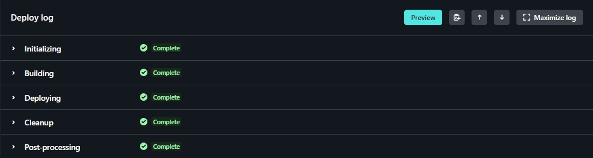
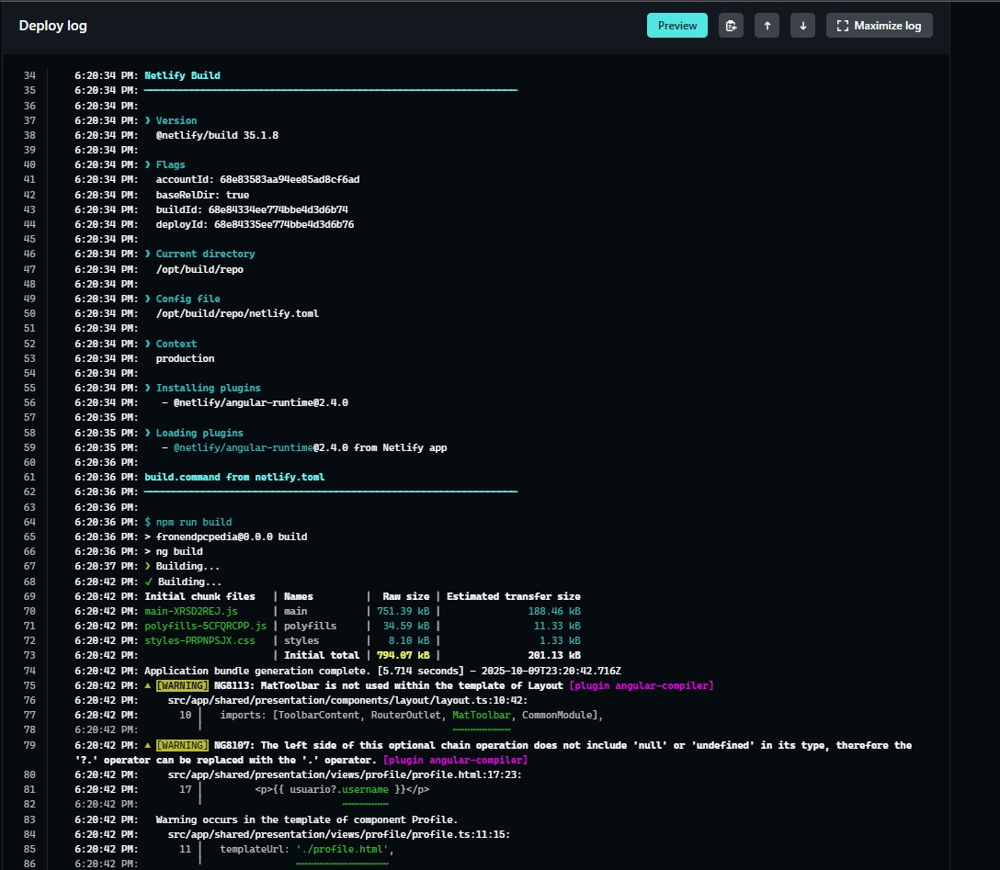
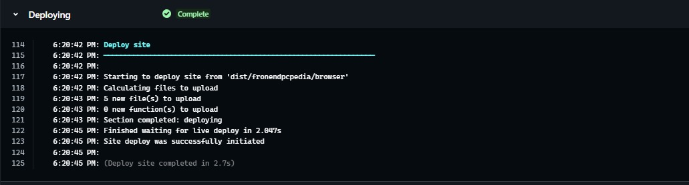
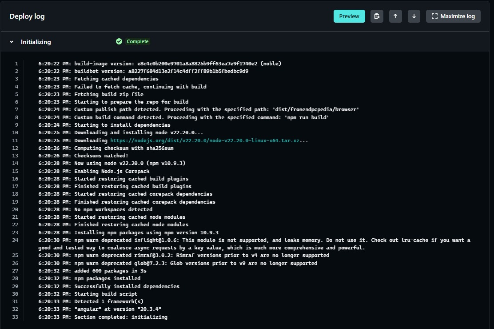

### 5.2.4. Acuerdo de Servicio - SaaS

**Última actualización: 03/05/2026**

Este Acuerdo de Servicio regula los términos y condiciones bajo los cuales **ECAT Leasing** otorga el acceso al modelo de **Smart Leasing** y sus servicios asociados. Al suscribir una propuesta comercial o utilizar nuestros servicios, el Cliente acepta los términos aquí descritos.

---
**1. Definiciones**
- **“Smart Leasing”**: Modelo de arrendamiento inteligente de activos tecnológicos (hardware) con servicios de gestión integrados.
- **“Equipos”**: Hardware moderno (laptops, desktops, servidores, etc.) provisto por ECAT Leasing bajo la modalidad de arrendamiento.
- **“Cliente”**: Empresa o institución educativa que contrata los servicios de ECAT Leasing.
- **“Ecosistema de Servicios”**: Incluye soporte técnico, mantenimiento, gestión de garantías y consultoría de optimización de recursos.

---
**2. Objeto**
ECAT Leasing se compromete a proveer al Cliente el uso de equipos tecnológicos actualizados y la prestación de servicios de soporte, mantenimiento y gestión de TI, permitiendo al Cliente optimizar sus costos y evitar la obsolescencia tecnológica.

---
**3. Arrendamiento y Planes Flexibles**
- Los equipos se entregan en modalidad de arrendamiento operativo, manteniendo ECAT Leasing la propiedad de los activos.
- El Cliente podrá elegir planes según sus objetivos, con la posibilidad de actualizar el hardware según los periodos de renovación pactados.
- Está prohibido subarrendar los equipos a terceros sin autorización expresa de ECAT Leasing.

---
**4. Responsabilidades del Cliente**
El Usuario se compromete a:
1. Utilizar los equipos exclusivamente para los fines comerciales o educativos declarados.
2. Designar un contacto técnico para coordinar las visitas de mantenimiento y soporte.
3. Notificar de inmediato cualquier incidencia, daño, robo o pérdida de los activos.
4. Cumplir puntualmente con los pagos correspondientes al plan de Smart Leasing contratado.

---
**5. Responsabilidades de ECAT Leasing**
ECAT Leasing se compromete a:
- Entregar equipos en óptimas condiciones de funcionamiento y actualizados tecnológicamente.
- Brindar soporte técnico especializado y mantenimiento preventivo/correctivo según el nivel de servicio acordado.
- Gestionar las garantías con fabricantes y realizar la sustitución de equipos en caso de fallas no reparables en sitio.
- Realizar la evaluación de recursos para recomendar la configuración de hardware más eficiente para el Cliente.

---
**6. Pagos, Facturación y Renovación**
- Las tarifas se basan en el plan seleccionado y el volumen de activos gestionados.
- El incumplimiento en el pago facultará a ECAT Leasing a suspender el soporte técnico o retirar los activos previa notificación.
- La renovación es automática según el contrato marco, salvo notificación previa por el Cliente.

---
**7. Propiedad Intelectual**
- Todas las metodologías de gestión, software de monitoreo y la marca **ECAT Leasing** son propiedad exclusiva de la startup.
- El Cliente no adquiere derechos de propiedad sobre el hardware, solo una licencia de uso durante la vigencia del arrendamiento.

---
**8. Limitación de Responsabilidad**
ECAT Leasing no será responsable por:
- Pérdida de información o datos contenidos en los discos duros de los equipos.
- Lucro cesante derivado de fallas técnicas imprevistas, aunque se compromete a la sustitución ágil del hardware.
- Daños causados por uso indebido o manipulación por personal no autorizado.

---
**9. Suspensión y Terminación**
ECAT Leasing podrá suspender el servicio ante el incumplimiento de los pagos o por uso indebido de los activos, reservándose el derecho de retirar los equipos físicos de las instalaciones del Cliente.

---
**10. Modificaciones**
ECAT Leasing se reserva el derecho de modificar estos Términos en cualquier momento. Las modificaciones se notificarán por canales oficiales y se considerarán aceptadas al continuar con el uso del servicio.

---
**11. Legislación y Jurisdicción**
Este Acuerdo se rige por las leyes de la República del Perú. Cualquier controversia será sometida a los tribunales de Lima Metropolitana.

### 5.2.5. Implemented RESTful API and/or Serverless Backend Evidence

Evidencias del despliegue:

## Railway

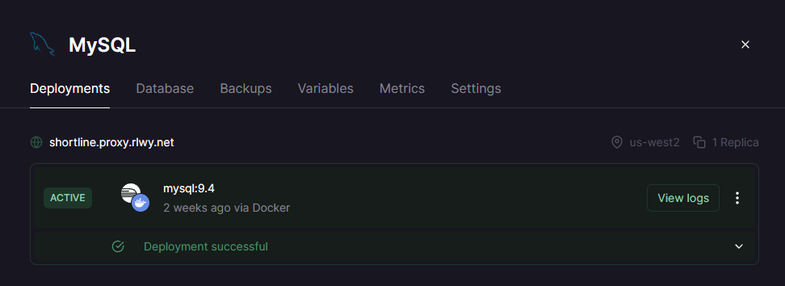

## Render

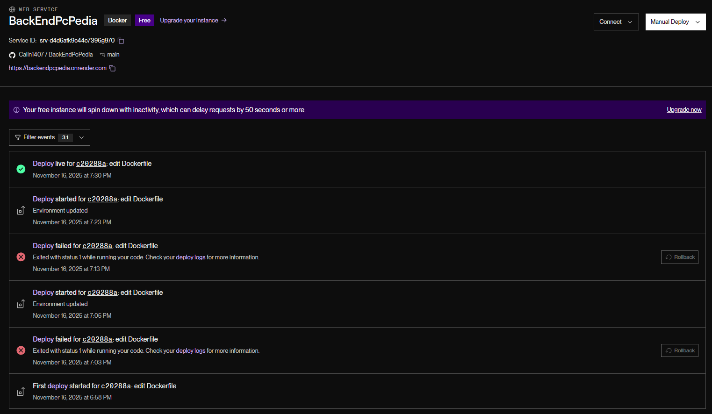
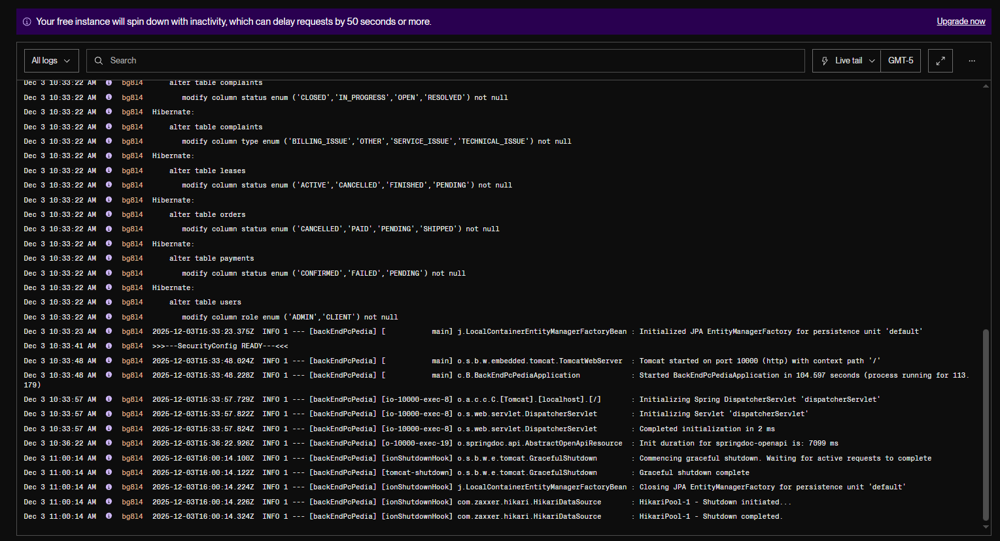

<ul>    
  <li><strong>Dockerfile implementado (multi-stage):</strong>
    <ul>
      <li>Stage builder basado en <code>eclipse-temurin:21-jdk</code></li>
      <li>Compilación con <code>./mvnw -q -B package -DskipTests</code></li>
      <li>Stage runtime con <code>eclipse-temurin:21-jre</code></li>
    </ul>
  </li>
    
  <ul>
    <li>Aplicación corriendo en contenedor Docker.</li>
    <li>Proovedor usado para deploy de BackEnd: Render</li>
    <li>Proovedor usado para Data Base: Railway</li>
    <li>URL pública: <strong>https://backendpcpedia.onrender.com</strong></li>
    <li>Acceso validado a rutas REST y Swagger durante el Sprint Review.</li>
  </ul>
</ul>

### 5.2.6. RESTful API documentation

### Arranque funcional
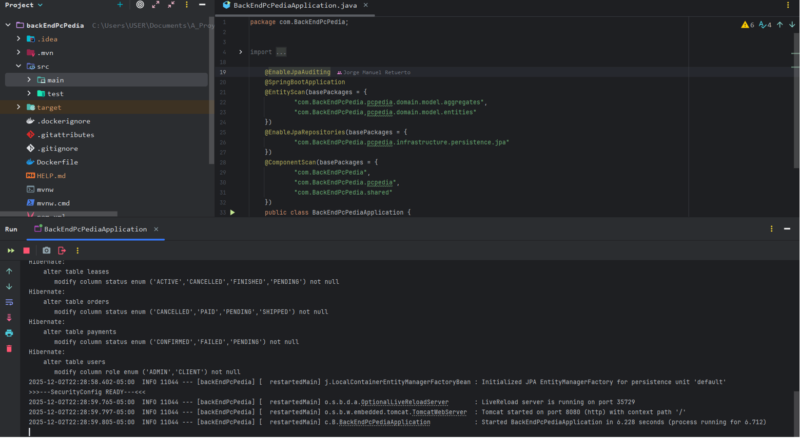

### Swagger funcional
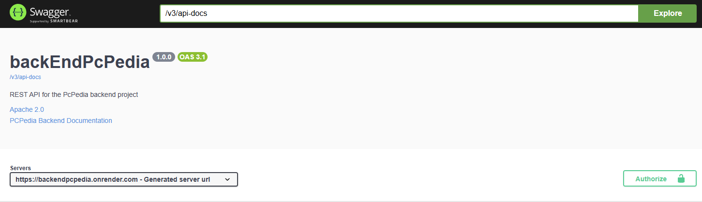

### Validación visual del API
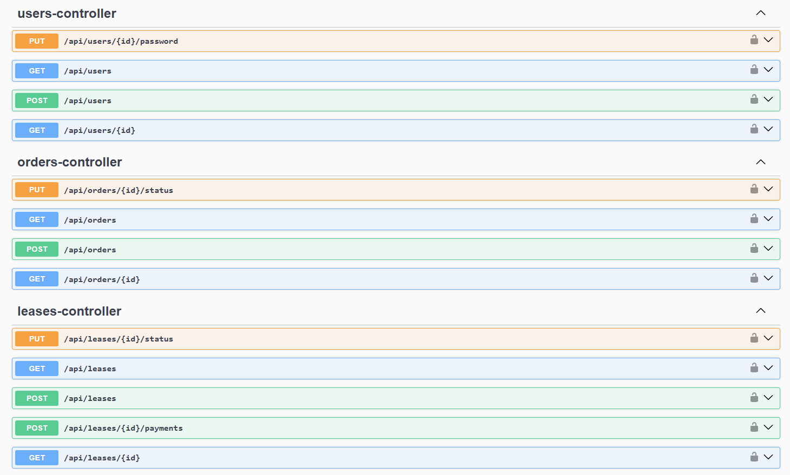
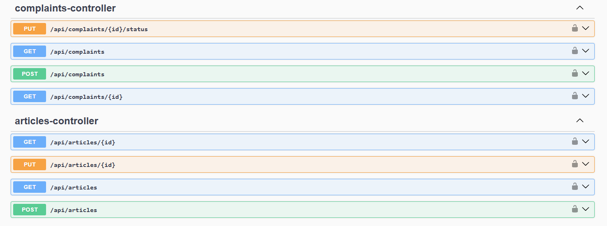

### 5.2.7. Team Collaboration Insights

Durante este sprint, se mantuvo una comunicación constante entre los miembros del equipo mediante reuniones semanales. Se utilizó <strong>GitHub</strong> para la gestión del código fuente y el seguimiento de tareas, y <strong>Trello</strong> para organizar el avance del sprint. Las tareas fueron gestionadas y completadas según las estimaciones, y la colaboración entre los miembros del equipo fue eficiente.

## 5.3. Video About-the-Product.

Como último artefacto del proyecto desarrollado, se ha desarrollado un video con orientación promocional e informativa, resumiendo el modelo de negocio, las características y beneficios del producto, incluyendo algunas escenas de interacción con el producto y al menos una opinión por cada segmento objetivo.  

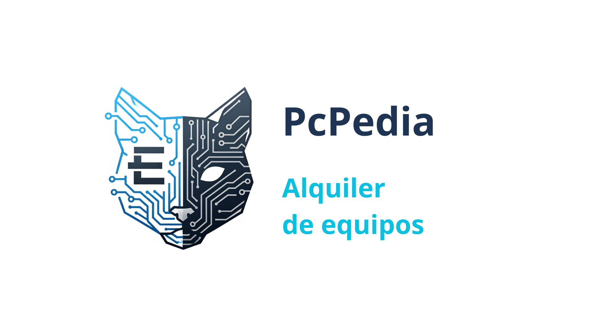  

**URL en OneDrive:** [OneDrive](https://upcedupe-my.sharepoint.com/:v:/g/personal/u20221a553_upc_edu_pe/IQDMIq-ktRmmRInkCK2IRzV1AXCy8kQNCCH14S3BM6ZQaAw)  
**URL en YouTube:** [YouTube](https://youtu.be/2q87N3Umm0w)  

# Capítulo VI: Product Verification & Validation
## 6.1. Testing Suites & Validation

### 6.1.1. Core Entities Unit Tests.

### 6.1.2. Core Integration Tests.

### 6.1.3. Core Behavior-Driven Development

### 6.1.4. Core System Tests.

## 6.2. Static testing & Verification

### 6.2.1. Static Code Analysis

#### 6.2.1.1. Coding standard & Code conventions.

#### 6.2.1.2. Code Quality & Code Security.

### 6.2.2. Reviews

## 6.3. Validation Interviews.

Este apartado se centra en examinar la experiencia del usuario a través de su interacción directa con la landing page y las aplicaciones del proyecto. El propósito principal es detectar fortalezas, así como áreas de mejora en términos de diseño, usabilidad y funcionalidad, recolectando el 'feedback' de un grupo representativo de nuestro público objetivo.

### 6.3.1. Diseño de Entrevistas.

Para que las pruebas reflejen con fidelidad cómo se comportará el usuario en el mundo real, esta sección describe la planificación detallada de las entrevistas. Aquí se definen los objetivos de la investigación, el perfil de los usuarios seleccionados y los flujos o temas clave que pondremos a prueba.

1. ¿La aplicación te permite identificar fácilmente el estado de tus contratos de leasing, los equipos asignados a tu organización y tus responsabilidades de pago o gestión?

2. ¿Te resulta claro cómo solicitar nuevos equipos, programar un mantenimiento preventivo/correctivo o reportar una incidencia técnica?

3. ¿El diseño visual (colores, íconos) te ayuda a entender rápidamente el estado de tus solicitudes (ej. Incidencia en atención, Mantenimiento programado, Evaluación de recursos completada)?

4. ¿Has tenido dificultades para navegar entre las secciones clave de la plataforma (Catálogo de hardware/Planes, Miembros/Sedes de la empresa, Reportes de costos/Rentabilidad, Notificaciones de mantenimiento)?

5. ¿Las palabras y etiquetas empleadas en la interfaz (ej. arrendamiento, obsolescencia, incidencia, mantenimiento preventivo, rentabilidad) son comprensibles y coherentes para tu perfil administrativo o de TI?

6. ¿Sientes que el flujo de acciones principales (crear una solicitud de soporte, cotizar un plan flexible, dar de baja un equipo o validar una renovación) es intuitivo?

7.¿Te resulta fácil identificar las respuestas del equipo de soporte especializado, el estado de las garantías o los comentarios dentro de un ticket de incidencia?

8. ¿La aplicación responde de manera clara mediante notificaciones o confirmaciones cuando realizas una acción crítica (ej. confirmar un plan de arrendamiento, reportar una falla de hardware o actualizar datos de facturación)?

9. ¿El diseño visual del panel de control y la gestión de incidencias se mantiene consistente si accedes desde la versión web o desde un dispositivo móvil?

10. ¿Qué mejorarías en la interfaz de gestión de Smart Leasing para que la toma de decisiones y el control de tus activos tecnológicos sea más claro o eficiente?

11. ¿Has encontrado algún elemento confuso o poco útil al momento de revisar la recomendación de equipos eficientes y rentables que el sistema sugiere para tu presupuesto?

12. ¿Consideras que el tiempo de respuesta de la plataforma es adecuado al interactuar con el catálogo de equipos, la carga de reportes de TI o la actualización de contratos?

13. ¿Te sientes cómodo utilizando la app desde tu dispositivo móvil para reportar incidencias en tiempo real o revisar alertas de mantenimiento técnico desde cualquier lugar de la empresa?

14. ¿La aplicación te proporciona la información y métricas financieras o técnicas que necesitas para verificar que estás optimizando los costos y evitando la obsolescencia tecnológica?

15. ¿Qué sensación general te deja el uso de la plataforma de ECAT Leasing en cuanto a la claridad para simplificar la gestión de tu TI, la organización de tus equipos y la facilidad de uso general?

### 6.3.2. Registro de Entrevistas.

| **Entrevista 1: Lider de Grupo** |                                                                                                                             |
|----------------------------------|--------------------------------------------------------------------------------------------------------------------------------------------------------------------------------------------------------------------------------------------------------------------------|
| Enlace de entrevista                 |     [https://upcedupe-my.sharepoint.com/:v:/g/personal/u20191b935_upc_edu_pe/IQChHuiT1-8JSaoTC9wlJLdSAXJKJrRyMkud2BNbDADQBjM?nav=eyJyZWZlcnJhbEluZm8iOnsicmVmZXJyYWxBcHAiOiJTdHJlYW1XZWJBcHAiLCJyZWZlcnJhbFZpZXciOiJTaGFyZURpYWxvZy1MaW5rIiwicmVmZXJyYWxBcHBQbGF0Zm9ybSI6IldlYiIsInJlZmVycmFsTW9kZSI6InZpZXcifX0%3D&e=pxN6XL](https://upcedupe-my.sharepoint.com/:v:/g/personal/u20191b935_upc_edu_pe/IQChHuiT1-8JSaoTC9wlJLdSAXJKJrRyMkud2BNbDADQBjM?nav=eyJyZWZlcnJhbEluZm8iOnsicmVmZXJyYWxBcHAiOiJTdHJlYW1XZWJBcHAiLCJyZWZlcnJhbFZpZXciOiJTaGFyZURpYWxvZy1MaW5rIiwicmVmZXJyYWxBcHBQbGF0Zm9ybSI6IldlYiIsInJlZmVycmFsTW9kZSI6InZpZXcifX0%3D&e=pxN6XL)                                                                                                                                                                                                                                                                 |
| Nombre de Entrevistado           | Emmanuel Ñahuiña                                                                                                                                                                                                                                                         |
| Edad                             | 23                                                                                                                                                                                                                                                                       |
| Profesión                        | Desarrollador frontend independiente                                                                                                                                                                                                                           |
| Distrito                         | Villa el salvador                                                                                                                                                                                                                                                                    |
| Duración de la Entrevista        | 00:00                                                                                                                                                                                                                                                                    |
| Minuto de inicio                 | 00:00                                                                                                                                                                                                                                                                    |
| **Análisis de la Entrevista**    |                                                                                                                                                                                                                                                                          |
|  Gestión de Equipos y Contratos             | Comenta que la visualización del catálogo de hardware y el estado de los planes de arrendamiento (Smart Leasing) es muy clara y limpia visualmente.                                                          |
| Soporte e Incidencias                | Considera sencillo reportar fallas de hardware y programar mantenimientos, pero sugiere agregar una leyenda o tooltip para identificar qué significa exactamente cada color en el estado del ticket (ej. si está "En atención" o "Pendiente de repuesto"). |
| Reportes y Optimización          | Argumenta que la sección de reportes de costos y rentabilidad es la más útil para él, ya que al trabajar independiente necesita justificar rápido que está optimizando el presupuesto y evitar la obsolescencia tecnológica.                |
| Solicitudes de Validación       | Menciona que la confirmación de contratos y renovación de planes está bien distribuida, pero añadiría un color de fondo sutil a las alertas críticas (como vencimientos de garantía) para que resalten más a primera vista.   |
| Navegación General               | Como desarrollador frontend, destaca que la interfaz es responsiva y se adapta bien al móvil para reportar incidencias en ruta. Siente que hay muchas opciones administrativas al inicio, pero la curva de aprendizaje es bastante corta e intuitiva.        |

<table> 
  <tbody> 
    <tr> 
      <td>Entrevista 2</td> 
      <td>
</td>
    </tr> 
    <tr> 
      <td>Enlace a la entrevista</td> 
      <td> https://upcedupe-my.sharepoint.com/:v:/g/personal/u20191b935_upc_edu_pe/IQAFzHw2-eABQo0QQDoV1qO8AcrHQSFP35Mry2ZAaXNGOXc?nav=eyJyZWZlcnJhbEluZm8iOnsicmVmZXJyYWxBcHAiOiJTdHJlYW1XZWJBcHAiLCJyZWZlcnJhbFZpZXciOiJTaGFyZURpYWxvZy1MaW5rIiwicmVmZXJyYWxBcHBQbGF0Zm9ybSI6IldlYiIsInJlZmVycmFsTW9kZSI6InZpZXcifX0%3D&e=f1QRnz </td>
    </tr> 
    <tr> 
      <td>Nombre Entrevistado</td> 
      <td>Oscar Román</td> 
    </tr> 
    <tr> 
      <td>Edad</td> 
      <td>24</td> 
    </tr> 
    <tr> 
      <td>Distrito</td> 
      <td>Chorrillos</td>
    </tr> 
    <tr> 
      <td>Ocupación</td> 
      <td>Estudiante de Ingeniería de Ciberseguridad</td> 
    </tr> 
    <tr> 
      <td>Duración Entrevista</td> 
      <td>06:12 minutos</td> 
    </tr> 
    <tr> 
      <td>Minuto de Inicio</td> 
      <td>0:00</td> 
    </tr> 
    <tr> 
      <td>Análisis</td> 
      <td>El entrevistado considera que la aplicación es <strong>segura, ordenada y de rápida respuesta</strong> para la gestión de activos tecnológicos. Destaca que la <strong>organización de contratos y control de hardware</strong> es altamente transparente, permitiendo mapear responsabilidades de TI sin complicaciones. Resalta que el <strong>diseño visual</strong> mediante colores e íconos facilita el reconocimiento inmediato de estados críticos en incidencias o mantenimientos preventivos. La <strong>navegación general</strong> entre el catálogo, los reportes financieros y las alertas le pareció fluida, valorando positivamente que los módulos de administración de sedes cuenten con una estructura limpia. Respecto a la consistencia, afirma que las confirmaciones ante acciones críticas (como la renovación de un plan) son claras y que la experiencia en la versión <strong>móvil es sólida</strong>, ideal para reportar incidencias de hardware en tiempo real. Como oportunidad de mejora desde su perspectiva técnica, propone <strong>fortalecer el feedback visual en las alertas críticas</strong> de garantías o vulnerabilidades de obsolescencia, utilizando notificaciones emergentes (pop-ups) más llamativas o colores de fondo de alta prioridad que obliguen a una atención inmediata del administrador. En conclusión, percibe la plataforma como un entorno <strong>confiable, robusto y muy amigable</strong> para mitigar riesgos logísticos y simplificar la gestión operativa de TI.</td> 
    </tr> 
  </tbody> 
</table>

### 6.3.3. Evaluaciones según heurísticas.

Esta sección analiza los hallazgos de las entrevistas aplicando los principios heurísticos de usabilidad. Permite identificar problemas y oportunidades de mejora en la experiencia del usuario.

**Aplicación para evaluar:** ECAT Leasing

**Tareas que evaluar:**
- Interpretar los colores y estados de los tickets de incidencia y mantenimiento técnico.
- Diferenciar entre el catálogo de "Hardware disponible" y las "Solicitudes de leasing activas".
- Configurar y cotizar un plan flexible según el presupuesto asignado.
- Navegar por la aplicación para acceder a contratos, sedes de la empresa, reportes y alertas.
- Comprender las métricas financieras de optimización de costos y obsolescencia tecnológica.
- Filtrar incidencias de hardware según estados específicos, incluyendo "Pendientes de repuesto" o "Garantías por vencer".
- Identificar claramente los mensajes de confirmación en acciones críticas (como dar de baja un equipo o renovar un contrato).
- Evaluar el contraste visual, legibilidad de etiquetas técnicas y visibilidad de alertas críticas de TI.
- Verificar la correcta adaptación del diseño responsivo en pantallas móviles para el reporte de incidencias in situ.
- Determinar la eficiencia del flujo de navegación y la reducción de pasos redundantes en la gestión operativa.

**Escala de severidad**

| Valor | Descripción   |
|-------|---------------|
| 1     | No tan grave  |
| 2     | Leve          |
| 3     | Moderado      |
| 4     | Grave         |
| 5     | Muy grave     |

**Tabla de resumen**

| #Orden | Problema                                                                                              | Escala de Severidad | Heurística / Principio violado(a)                                     |
|--------|-------------------------------------------------------------------------------------------------------|---------------------|-----------------------------------------------------------------------|
| 1      | Falta de leyenda explícita sobre el significado de los colores en el estado de incidencias y soporte. | 3                   | Visibilidad del estado del sistema                                    |
| 2      | Diferencia visual difusa entre la navegación de "Catálogo de Hardware" y "Solicitudes de Leasing".    | 4                   | Consistencia y estándares                                             |
| 3      | Desglose comercial poco técnico en las recomendaciones del cotizador inteligente de presupuesto.     | 2                   | Correspondencia entre el sistema y el mundo real                      |
| 4      | Interfaz inicial densa en opciones administrativas y ausencia de un onboarding o accesos rápidos.     | 3                   | Flexibilidad y eficiencia de uso / Ayuda y documentación              |
| 5      | Alertas críticas de soporte y vencimiento de garantías poco resaltadas en el dashboard.                | 4                   | Visibilidad del estado del sistema / Prevención de errores            |
| 6      | Falta de un filtro específico para equipos "Pendientes de validación de baja" o reemplazo.            | 3                   | Flexibilidad y eficiencia de uso / Visibilidad del estado del sistema |
| 7      | Formato visual del hilo de conversación con el soporte técnico poco diferenciado.                     | 2                   | Estética y diseño minimalista / Visibilidad del sistema               |
| 8      | Ausencia de un modal de confirmación con doble factor para la cancelación o baja definitiva de activos.| 3                   | Prevención de errores                                                 |
| 9      | Gráficos complejos de depreciación financiera con reducción extrema de legibilidad en móviles.        | 2                   | Diseño responsivo / Consistencia y estándares                         |
| 10     | Flujo de navegación extenso para registrar una incidencia urgente (demasiados clics previos).        | 3                   | Flexibilidad y eficiencia de uso                                      |

---

#### Problema #1: Falta de leyenda explícita sobre el significado de los colores en el estado de incidencias y soporte

**Heurística violada:** Visibilidad del estado del sistema.  

**Descripción del problema:** Varios entrevistados mencionan que los colores ayudan a interpretar estados y prioridades, pero no existe una leyenda explícita que explique qué significa cada color o umbral (por ejemplo, estados de tareas o niveles de desempeño). Esto obliga al usuario a “deducir” el significado y genera una pequeña curva de aprendizaje innecesaria.

**Recomendación:** Incorporar una leyenda fija (por ejemplo, en la parte superior derecha de la vista de tareas y de reportes) donde se explique el significado de cada color y estado. Además, añadir *tooltips* o ayudas contextuales que, al pasar el cursor o tocar un ícono de ayuda, muestren brevemente qué representa cada color y umbral de desempeño. Esto reduce la ambigüedad y mejora la comprensión inmediata del estado del sistema.

---

#### Problema #2: Diferencia visual difusa entre la navegación de "Catálogo de Hardware" y "Solicitudes de Leasing"

**Heurística violada:** Consistencia y estándares.  

**Descripción del problema:** Al menos un entrevistado reportó confusión inicial entre las secciones de “tareas” y “solicitudes”. Aunque ambas pantallas están ordenadas, la nomenclatura y el diseño visual no hacen suficientemente evidente que se trata de conceptos distintos (trabajo asignado vs. solicitudes de cambio, validaciones u otros tipos de requerimientos). Esto puede provocar errores de interpretación y uso.

**Recomendación:** Reforzar la diferenciación visual y textual entre “tareas” y “solicitudes”. Por ejemplo, usar íconos distintos, colores de fondo diferenciados y subtítulos breves en cada pantalla (p. ej. “Tareas: actividades pendientes que debes completar” y “Solicitudes: pedidos o validaciones que requieren tu respuesta”). También se recomienda incluir un mensaje introductorio corto la primera vez que el usuario ingresa a cada sección.

---

#### Problema #3: Desglose comercial poco técnico en las recomendaciones del cotizador inteligente de presupuesto

**Heurística violada:** Correspondencia entre el sistema y el mundo real.  

**Descripción del problema:** Un entrevistado indicó confusión respecto al código del grupo al visualizar los detalles; no era evidente que ese valor correspondía al código que se comparte para unirse al grupo. La falta de una etiqueta clara o subtítulo obliga al usuario a adivinar su propósito.

**Recomendación:** Añadir una etiqueta explícita como “Código del grupo (compártelo para que otros se unan)” junto al valor, y un pequeño ícono de copiar para facilitar su uso. Esto alinea mejor el lenguaje de la interfaz con el modelo mental del usuario y hace más clara la función de este elemento.

---

#### Problema #4: Interfaz inicial densa en opciones administrativas y ausencia de un onboarding o accesos rápidos

**Heurísticas violadas:** Flexibilidad y eficiencia de uso / Ayuda y documentación.  

**Descripción del problema:** Aunque los usuarios con algo de experiencia perciben la navegación como clara y concisa, se menciona que, para un usuario nuevo, la cantidad de pantallas y opciones puede sentirse un poco extensa al inicio. Actualmente no existe un onboarding breve ni ayudas contextuales que expliquen las secciones clave (grupos, tareas, solicitudes, desempeño, atajos). Esto genera una pequeña barrera de entrada antes de aprovechar plenamente las funcionalidades.

**Recomendación:** Implementar un recorrido guiado (*tour*) la primera vez que el usuario inicie sesión, destacando las secciones principales y su propósito. Complementar esto con breves textos “¿Qué puedes hacer aquí?” en las pantallas más importantes y con ayudas contextuales (íconos de “i” o “?”) que puedan consultarse en cualquier momento. De esta manera, se reduce la carga cognitiva inicial y se acelera la curva de aprendizaje.

---

#### Problema #5: Alertas críticas de soporte y vencimiento de garantías poco resaltadas en el dashboard

**Heurísticas violadas:** Visibilidad del estado del sistema / Prevención de errores.  

**Descripción del problema:** Los entrevistados reconocen que existen mensajes de confirmación cuando se crean, editan o eliminan elementos; sin embargo, señalan que podrían estar mejor resaltados para que el usuario los perceba con mayor claridad. Si la retroalimentación visual es sutil, es posible que algunos usuarios duden sobre si la acción se ejecutó correctamente.

**Recomendación:** Aumentar la visibilidad de las notificaciones de confirmación mediante el uso de *toasts* o banners más notorios (uso de íconos de éxito/error, tipografía ligeramente más grande y contraste adecuado). Para acciones críticas (como eliminar tareas o grupos), incluir además un cuadro de diálogo de confirmación claro, reduciendo así el riesgo de errores y mejorando la percepción de control sobre la plataforma.

## 6.4. Auditoría de Experiencias de Usuario

### 6.4.1. Auditoría realizada.

#### 6.4.1.1. Información del grupo auditado.

#### 6.4.1.2. Cronograma de auditoría realizada.

#### 6.4.1.3. Contenido de auditoría realizada.

---

## Conclusiones

Durante el desarrollo del proyecto PcPedia, el equipo logró consolidar una solución web funcional que integra un frontend moderno y un backend robusto, implementados sobre una arquitectura modular basada en Domain-Driven Design (DDD). A lo largo de los sprints se definieron los contextos funcionales principales, se desarrollaron flujos críticos del negocio y se garantizó la comunicación efectiva entre los módulos de autenticación, catálogo, contratos, tickets, pagos, facturación e inventario.

En este último sprint, el equipo alcanzó un hito fundamental: la integración completa del frontend con los servicios del backend, habilitando funcionalidades reales como login, gestión de sesión, visualización de activos, panel administrativo, consulta de contratos, manejo de incidencias y navegación fluida entre los distintos módulos. Asimismo, se realizó el despliegue exitoso tanto del frontend como del backend, lo que permite validar la operación del sistema en un entorno real.

El trabajo colaborativo permitió reforzar las buenas prácticas de desarrollo: mensajes de commit consistentes, estructura clara de branches, revisión cruzada de código y un uso adecuado de herramientas ágiles para el seguimiento del progreso. La modularidad del sistema y la separación por contextos facilitaron la mantenibilidad del proyecto y permitieron que distintos miembros del equipo contribuyeran en paralelo sin afectar la estabilidad del código.

## Recomendaciones

    Se recomienda, para etapas posteriores, ampliar la cobertura de pruebas automáticas, optimizar la experiencia de usuario mediante iteraciones basadas en feedback real, reforzar la seguridad de los módulos críticos y continuar con la documentación técnica y funcional del sistema. Los aprendizajes obtenidos en este proyecto fortalecen la capacidad del equipo para abordar nuevas funcionalidades y consolidan una base sólida para futuras mejoras y escalamiento de PcPedia como una plataforma integral de arrendamiento y gestión de equipos tecnológicos.

## Video About-The-Team

**URL de video About-The-Team** [AboutTheTeam](https://youtu.be/qiV-ZW8_nnM)
---

##  Bibliografía

<ul>
  <li>Driessen, V. (2010). <em>A successful Git branching model</em>. Disponible en: <a href="https://nvie.com/posts/a-successful-git-branching-model/" target="_blank">https://nvie.com/posts/a-successful-git-branching-model/</a></li>
  <li>Cucumber. (s.f.). <em>Gherkin Reference</em>. Recuperado de: <a href="https://cucumber.io/docs/gherkin/" target="_blank">https://cucumber.io/docs/gherkin/</a></li>
  <li>Figma. (s.f.). <em>Figma: Collaborative Interface Design Tool</em>. Recuperado de: <a href="https://www.figma.com/" target="_blank">https://www.figma.com/</a></li>
  <li>Lucidchart. (s.f.). <em>Lucidchart: Diagramming & Visualization Software</em>. Recuperado de: <a href="https://www.lucidchart.com/" target="_blank">https://www.lucidchart.com/</a></li>
  <li>Mozilla Developer Network. (s.f.). <em>HTML, CSS y JavaScript</em>. Recuperado de: <a href="https://developer.mozilla.org/es/docs/Web" target="_blank">https://developer.mozilla.org/es/docs/Web</a></li>
  <li>GitHub. (s.f.). <em>GitHub: Where the world builds software</em>. Recuperado de: <a href="https://github.com/" target="_blank">https://github.com/</a></li>
  <li>Microsoft. (s.f.). <em>Visual Studio Code</em>. Recuperado de: <a href="https://code.visualstudio.com/" target="_blank">https://code.visualstudio.com/</a></li>
  <li>W3Schools. (s.f.). <em>HTML5 Syntax</em>. Recuperado de: <a href="https://www.w3schools.com/html/html5_syntax.asp" target="_blank">https://www.w3schools.com/html/html5_syntax.asp</a></li>
</ul>

---

## Anexos

<section id="anexos">
  <h3>1. Organización y Repositorios en GitHub</h3>
  
El proyecto PcPedia se encuentra alojado bajo la organización de GitHub del curso 1ASI0729-7401-2520-EcatLeasing-PcPedia. A continuación se detallan los repositorios principales utilizados:

  <ul>
    <li><strong>Repositorio de la Organización:</strong> 
      <a href="https://github.com/1ASI0729-7401-2520-EcatLeasing-PcPedia" target="_blank">
        https://github.com/1ASI0729-7401-2520-EcatLeasing-PcPedia
      </a>
    </li>
    <li><strong>Repositorio del Informe Final:</strong> 
      <a href="https://github.com/1ASI0729-7401-2520-EcatLeasing-PcPedia/Report-PcPedia" target="_blank">
        https://github.com/1ASI0729-7401-2520-EcatLeasing-PcPedia/Report-PcPedia
      </a>
    </li>
    <li><strong>Repositorio de la Landing Page:</strong> 
      <a href="https://github.com/1ASI0729-7401-2520-EcatLeasing-PcPedia/Landing-Page-PcPedia" target="_blank">
        https://github.com/1ASI0729-7401-2520-EcatLeasing-PcPedia/Landing-Page-PcPedia
      </a>
    </li>
    <li><strong>Repositorio de el Frontend:</strong> 
      <a href="https://github.com/1ASI0729-7401-2520-EcatLeasing-PcPedia/Front-end-PcPedia" target="_blank">
        https://github.com/1ASI0729-7401-2520-EcatLeasing-PcPedia/Front-end-PcPedia
      </a>
    </li>
    <li><strong>Repositorio de el Backend:</strong> 
      <a href="https://github.com/1ASI0729-7401-2520-EcatLeasing-PcPedia/Back-end-PcPedia" target="_blank">
        https://github.com/1ASI0729-7401-2520-EcatLeasing-PcPedia/Back-end-PcPedia
      </a>
    </li>
  </ul>

  <h3>2. Despliegue de la Landing Page</h3>
  
La Landing Page fue desarrollada por Alessandro Ramiro Condori Lozano y desplegada utilizando GitHub Pages. Esta página sirve como presentación inicial del producto PcPedia.

  <ul>
    <li><strong>Despliegue de la Landing Page en producción:</strong> 
      <a href="https://1asi0729-7401-2520-ecatleasing-pcpedia.github.io/Landing-Page-PcPedia/" target="_blank">
        https://1asi0729-7401-2520-ecatleasing-pcpedia.github.io/Landing-Page-PcPedia/
      </a>
    </li>
    <li><strong>Link del Mock-up en Figma:</strong> 
      <a href="https://www.figma.com/design/oiLz93LcaZJmdmEKi6h46I/FIGMA-PCPEDIA?node-id=1-15&t=wvrVBChCM91tnOsZ-1" target="_blank">
        https://www.figma.com/design/oiLz93LcaZJmdmEKi6h46I/FIGMA-PCPEDIA
      </a>
    </li>
  </ul>
  <h3>3. Despliegue de el Frontend</h3>
  
El Frontend fue desplegado utilizando Netlify. Esta página permite a los usuarios interactuar con la interfaz de manera satisfactoria.

  <ul>
    <li><strong>Despliegue de el Frontend en producción:</strong> 
      <a href="https://pcpedia.netlify.app" target="_blank">
          https://pcpedia.netlify.app
      </a>
    </li>
  </ul>
  <h3>4. Despliegue de el Backend</h3>
  
El backend fue desplegado utilizando Render. Esta página contiene la lógica de negocio, el manejo de la base de datos y control de APIs.

  <ul>
    <li><strong>Despliegue de el Backend:</strong> 
      <a href="https://pcpediaapi-egd4b8frh3bqcsde.canadacentral-01.azurewebsites.net/swagger-ui/index.html" target="_blank">
          https://pcpediaapi-egd4b8frh3bqcsde.canadacentral-01.azurewebsites.net/swagger-ui/index.html
      </a>
    </li>
  </ul>
  <h3>5. Exposicion del proyecto TF</h3>
  
https://youtu.be/jFJ_QsxzDIw

</section>

---

 

*PCPedia · Diseño de Experimentos de Ingeniería de Software · UPC 2026-10*

