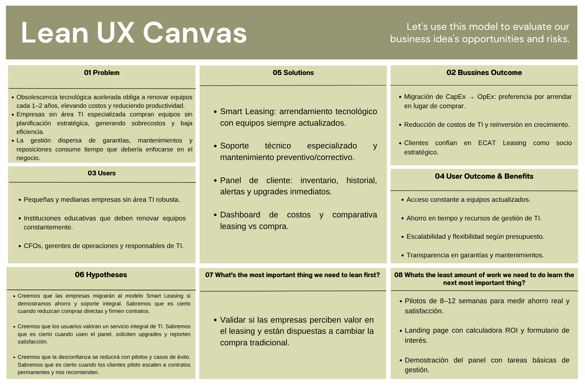
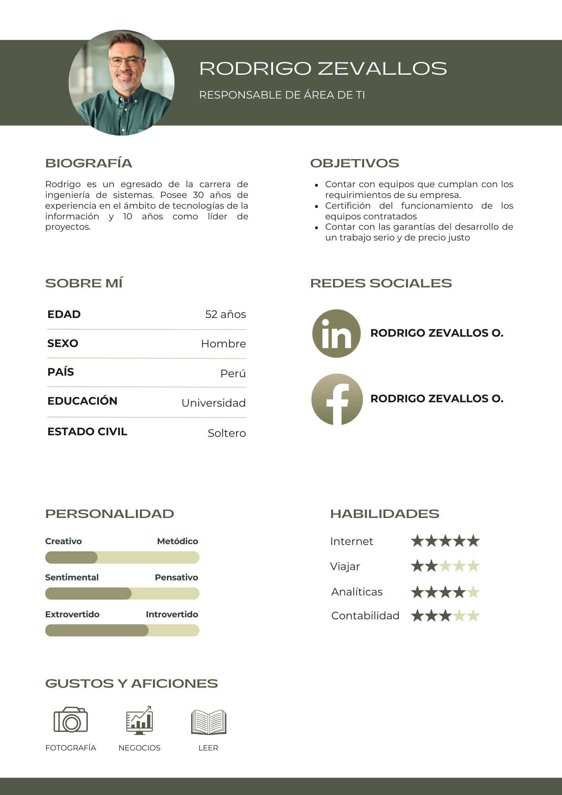
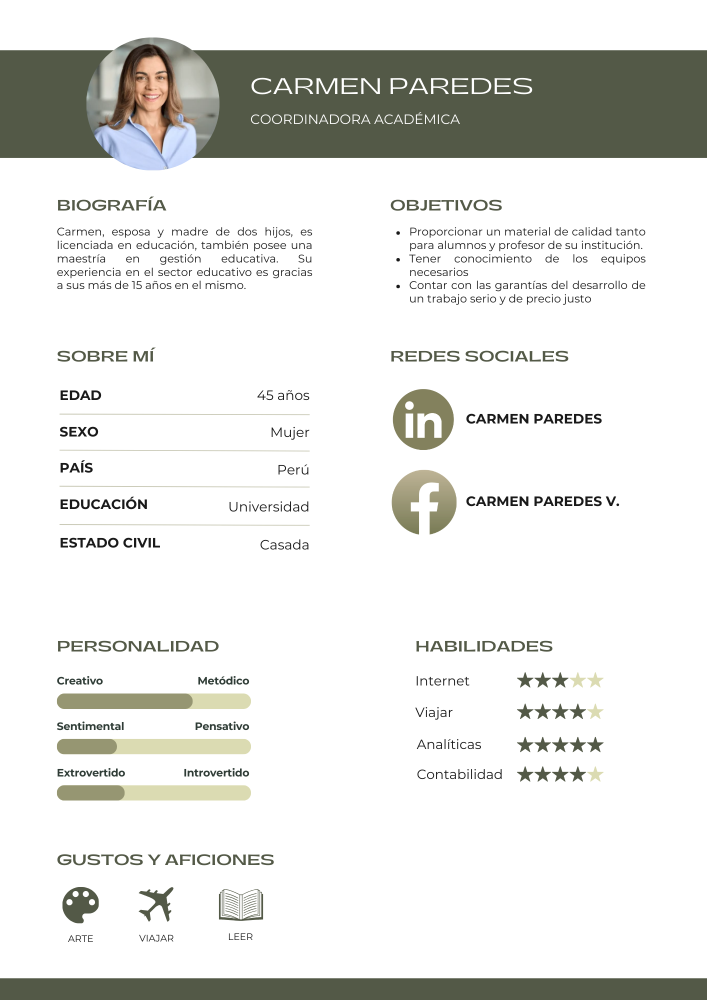
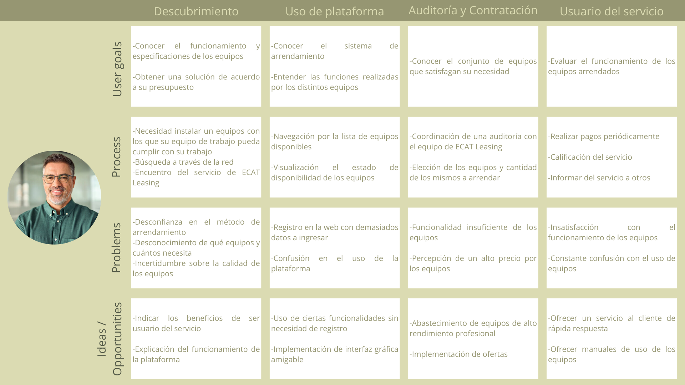
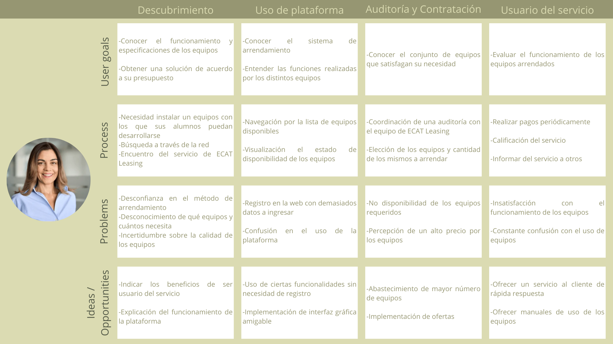
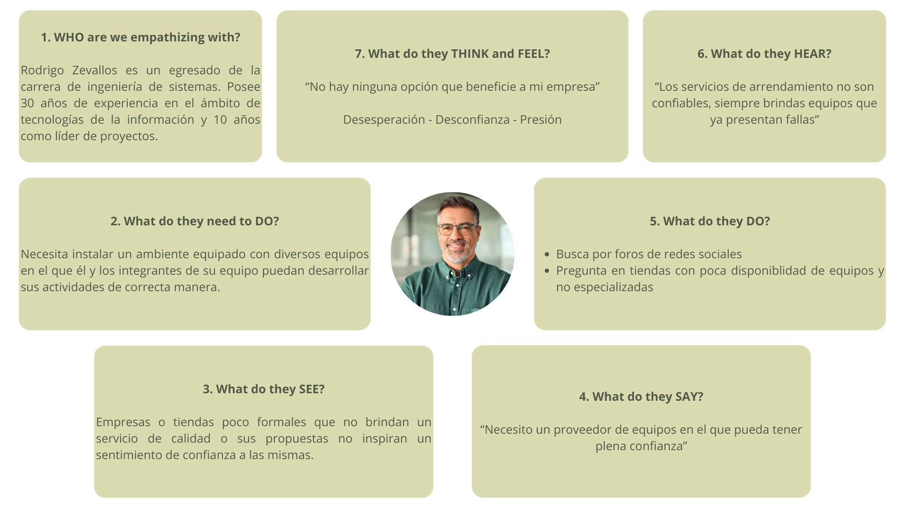
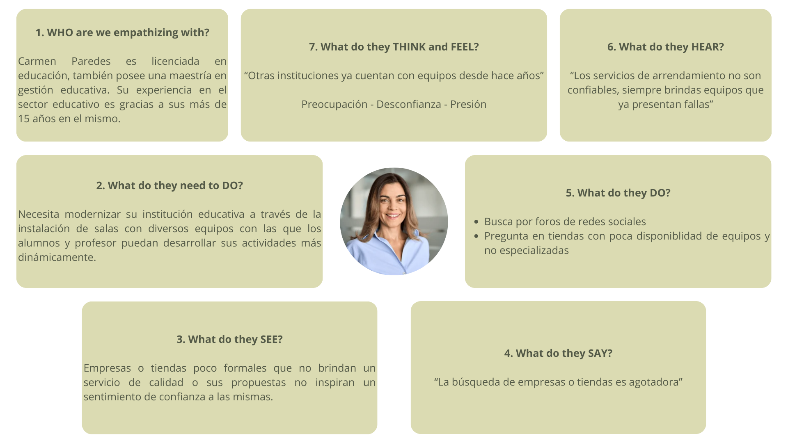

 

# Universidad Peruana de Ciencias Aplicadas
### Facultad de Ingeniería · Ciclo 2026-10

 

# Informe de Proyecto - Avance 1

## Startup: EcatLeasing

## Producto: PCPedia

 

**Código del Curso:** 1ASI0732 &nbsp;|&nbsp; **Nombre del Curso:** Diseño de Experimentos de Ingeniería de Software

**NRC:** `16880`

**Profesor:** Julio Manuel Noriega Melendez

 

### Integrantes

`U20231D390` - `Bendezu Navarro Rúbens`

`U20231c996` - `Hernandez Poma Sebastian Eduardo`

`U20191B935` - `Carranza Tesén Joaquín Enrique`

`U202311469` - `Arroyo Gonzales, Emily Juliette`

### **2026**

---

## Registro de Versiones del Informe

| Versión |   Fecha    |                                                                                Participantes                                                                                 | Descripción de modificación |
|:-------:|:----------:|:----------------------------------------------------------------------------------------------------------------------------------------------------------------------------:|:---------------------------|
| AV1 | 2026-05-02 | Bendezu Navarro, Rúbens   Hernandez Poma, Sebastian Eduardo   Carranza Tesén, Joaquín Enrique   Arroyo Gonzales, Emily Juliette  | || |            |                                                                                                                                                                              | |

---

## Project Report Collaboration Insights

**URL del Repositorio:** [`https://github.com/PCPedia2026/Report`](https://github.com/PCPedia2026/Report)

*(Esta sección se irá expandiendo con cada entrega)*

---

## Tabla de Contenidos
#### [Contenido](#-tabla-de-contenidos)
#### [Student Outcome](#-student-outcome)

#### [Capítulo I: Introducción](#capítulo-i-introducción-1)
- [1.1. Startup Profile](#11-startup-profile)
    - [1.1.1. Descripción de la Startup](#111-descripción-de-la-startup)
    - [1.1.2. Perfiles de integrantes del equipo](#112-perfiles-de-integrantes-del-equipo)
- [1.2. Solution Profile](#12-solution-profile)
    - [1.2.1. Antecedentes y problemática](#121-antecedentes-y-problemática)
    - [1.2.2. Lean UX Process](#122-lean-ux-process)
        - [1.2.2.1. Lean UX Problem Statements](#1221-lean-ux-problem-statements)
        - [1.2.2.2. Lean UX Assumptions](#1222-lean-ux-assumptions)
        - [1.2.2.3. Lean UX Hypothesis Statements](#1223-lean-ux-hypothesis-statements)
        - [1.2.2.4. Lean UX Canvas](#1224-lean-ux-canvas)
- [1.3. Segmentos objetivo](#13-segmentos-objetivo)

#### [Capítulo II: Requirements Elicitation & Analysis](#capítulo-ii-requirements-elicitation--analysis-1)
- [2.1. Competidores](#21-competidores)
    - [2.1.1. Análisis competitivo](#211-análisis-competitivo)
    - [2.1.2. Estrategias y tácticas frente a competidores](#212-estrategias-y-tácticas-frente-a-competidores)
- [2.2. Entrevistas](#22-entrevistas)
    - [2.2.1. Diseño de entrevistas](#221-diseño-de-entrevistas)
    - [2.2.2. Registro de entrevistas](#222-registro-de-entrevistas)
    - [2.2.3. Análisis de entrevistas](#223-análisis-de-entrevistas)
- [2.3. Needfinding](#23-needfinding)
    - [2.3.1. User Personas](#231-user-personas)
    - [2.3.2. User Task Matrix](#232-user-task-matrix)
    - [2.3.3. User Journey Mapping](#233-user-journey-mapping)
    - [2.3.4. Empathy Mapping](#234-empathy-mapping)
    - [2.3.5. As-is Scenario Mapping](#235-as-is-scenario-mapping)
- [2.4. Ubiquitous Language](#24-ubiquitous-language)

#### [Capítulo III: Requirements Specification](#capítulo-iii-requirements-specification-1)
- [3.1. To-Be Scenario](#31-to-be-scenario)
- [3.2. User Stories](#32-user-stories)
- [3.3. Product Backlog](#33-product-backlog)
- [3.4. Impact Mapping](#34-impact-mapping)

#### [Capítulo IV: Product Design](#capítulo-iv-product-design-1)
- [4.1. Style Guidelines](#41-style-guidelines)
    - [4.1.1. General Style Guidelines](#411-general-style-guidelines)
    - [4.1.2. Web Style Guidelines](#412-web-style-guidelines)
    - [4.1.3. Mobile Style Guidelines](#413-mobile-style-guidelines)
      - [4.1.3.1. iOS Mobile Style Guidelines](#4131-ios-mobile-style-guidelines)
      - [4.1.3.2. Android Mobile Style Guidelines](#4132-android-mobile-style-guidelines)
- [4.2. Information Architecture](#42-information-architecture)
    - [4.2.1. Organization Systems](#421-organization-systems)
    - [4.2.2. Labeling Systems](#422-labeling-systems)
    - [4.2.3. SEO Tags and Meta Tags](#423-seo-tags-and-meta-tags)
    - [4.2.4. Searching Systems](#424-searching-systems)
    - [4.2.5. Navigation Systems](#425-navigation-systems)
- [4.3. Landing Page UI Design](#43-landing-page-ui-design)
    - [4.3.1. Landing Page Wireframe](#431-landing-page-wireframe)
    - [4.3.2. Landing Page Mock-up](#432-landing-page-mock-up)
- [4.4. Mobile Applications UX/UI Design](#44-mobile-applications-uxui-design)
    - [4.4.1. Mobile Applications Wireframes](#441-mobile-applications-wireframes)
    - [4.4.2. Mobile Applications Wireflow Diagrams](#442-mobile-applications-wireflow-diagrams)
    - [4.4.3. Mobile Applications Mock-ups](#443-mobile-applications-mock-ups)
    - [4.4.4. Mobile Applications User Flow Diagrams](#444-mobile-applications-user-flow-diagrams)
- [4.5. Mobile Applications Prototyping](#45-mobile-applications-prototyping)
    - [4.5.1. Android Mobile Applications Prototyping](#451-android-mobile-applications-prototyping)
    - [4.5.2. iOS Mobile Applications Prototyping](#452-ios-mobile-applications-prototyping)
- [4.6. Web Applications UX/UI Design.](#46-web-applications-uxui-design)
    - [4.6.1. Web Applications Wireframes](#461-web-applications-wireframes)
    - [4.6.2. Web Applications Wireflow Diagrams](#461-web-applications-wireflow-diagrams)
    - [4.6.3. Web Applications Mock-ups](#463-web-applications-mockups)
    - [4.6.4. Web Applications User Flow Diagrams](#464-web-applications-user-flow-diagrams)
- [4.7. Web Applications Prototyping](#47-web-applications-prototyping)
- [4.8. Domain-Driven Software Architecture](#48-domain-driven-software-architecture)
    - [4.8.1. Software Architecture Context Diagram](#481-software-architecture-context-diagram)
    - [4.8.2. Software Architecture Container Diagrams](#482-software-architecture-container-diagrams)
    - [4.8.3. Software Architecture Components Diagrams](#483-software-architecture-components-diagrams)
- [4.9. Software Object-Oriented Design](#49-software-object-oriented-design)
    - [4.9.1. Class Diagrams](#491-class-diagrams)
    - [4.9.2. Class Dictionary](#492-class-dictionary)
- [4.10. Database Design](#410-database-design)
    - [4.10.1. Relational/Non-Relational Database Diagram](#4101-relationalnonrelational-database-diagram)
#### [Capítulo V: Product Implementation](#capítulo-v-product-implementation)
- [5.1. Software Configuration Management](#51-software-configuration-management)
    - [5.1.1. Software Development Environment Configuration](#511-software-development-environment-configuration)
    - [5.1.2. Source Code Management](#512-source-code-management)
    - [5.1.3. Source Code Style Guide & Conventions](#513-source-code-style-guide--conventions)
    - [5.1.4. Software Deployment Configuration](#514-software-deployment-configuration)
- [5.2. Product Implementation & Deployment ](#52-product-implementation-deployment)
    - [5.2.1. Sprint Backlogs](#521-sprint-backlogs)
    - [5.2.2. Implemented Landing Page Evidence](#522-implemented-landingpage-evidence)
    - [5.2.3. Implemented Frontend-Web Application Evidence](#523-implemented-frontendweb-application-evidence)
    - [5.2.4. Acuerdo de Servicio - SaaS](#524-acuerdo-de-servicio-saas)
    - [5.2.5. Implemented Native-Mobile Application Evidence](#525-implemented-nativemobile-application-evidence)
    - [5.2.6. Implemented RESTful API and/or Serverless Backend Evidence](#526-implemented-restfulapi-andor-serverless-backend-evidence)
    - [5.2.7. RESTful API documentation](#527-restfulapi-documentation)
    - [5.2.8. Team Collaboration Insights](#528-team-collaboration-insights)
- [5.3. Video About-the-Product](#53-video-about-the-product)

#### [Conclusiones](#conclusiones-1)

#### [Recomendaciones](#recomendaciones-1)

#### [Video App Validation](#video-app-validation)

#### [Video About-the-Team](#video-about-the-team-1)

#### [Bibliografía](#-bibliografía)

#### [Anexos](#anexos-1)

---

## Student Outcome

En Ingeniería de Software, el logro contribuye a alcanzar el:

ABET – EAC - Student Outcome 4: La capacidad de reconocer responsabilidades éticas y profesionales en situaciones de ingeniería y hacer juicios informados, que deben considerar el impacto de las soluciones de ingeniería en contextos globales, económicos, ambientales y sociales.

En el siguiente cuadro se describen las acciones realizadas y enunciados de conclusiones por parte del
grupo, que permiten sustentar el haber alcanzado el logro del ABET - EAC - Student Outcome 4.

| Criterio específico | Acciones realizadas                                                                                                                                                                                                  | Conclusiones |
|:---|:---------------------------------------------------------------------------------------------------------------------------------------------------------------------------------------------------------------------|:-------------|
| **Identifica y evalúa las implicancias éticas y profesionales en el desarrollo de soluciones de ingeniería.** | **Bendezu Navarro Rúbens**   **AV1:**     **Hernandez Poma Sebastian Eduardo**   **AV1:**     **Carranza Tesén Joaquín Enrique**   **AV1:**     **Arroyo Gonzales, Emily**   **AV1:**   | **Av1:**     |
| **Analiza el impacto de las soluciones de ingeniería en contextos sociales, económicos y ambientales para tomar decisiones informadas.** | **Bendezu Navarro Rúbens**   **AV1:**    **Hernandez Poma Sebastian Eduardo**   **AV1:**     **Carranza Tesén Joaquín Enrique**   **AV1:**     **Arroyo Gonzales, Emily**  **AV1:**    |  **AV1:**            |

---

# Capítulo I: Introducción

---

## 1.1. Startup Profile

### 1.1.1. Descripción de la Startup

ECAT Leasing es una startup dedicada a transformar la manera en que las organizaciones acceden y gestionan su tecnología. Nuestro producto principal, Smart Leasing, ofrece un modelo de arrendamiento inteligente que garantiza a empresas y al sector educativo contar siempre con equipos actualizados, evitando la carga de la obsolescencia tecnológica. A través de planes flexibles, brindamos no solo el acceso a hardware moderno, sino también un ecosistema de servicios de valor agregado que incluye soporte técnico especializado, mantenimiento preventivo y correctivo, gestión de garantías y atención ágil a incidencias.

Además, comprendemos que cada empresa tiene necesidades y presupuestos distintos. Por ello, incorporamos dentro de Smart Leasing el servicio que evalúa los recursos, procesos y objetivos de cada cliente para recomendar los equipos más eficientes y rentables, asegurando que inviertan solo en lo que realmente necesitan. De esta manera, ECAT Leasing se convierte en un socio estratégico que simplifica la gestión de TI, optimiza los costos y permite que nuestros clientes se concentren en lo más importante: el crecimiento de su negocio.

**Misión:** Facilitar la vida de las empresas haciéndonos cargo de sus activos de TI, brindando equipos siempre actualizados con nuestro servicio de Smart Leasing, junto con soporte, mantenimiento y gestión de garantías, para que nuestros clientes se concentren en crecer sin preocuparse por la tecnología.

**Visión:** Ser la empresa referente en Latinoamérica en servicios de arrendamiento tecnológico inteligente, simplificando la gestión de activos TI y ayudando a las organizaciones a enfocarse en su crecimiento, mientras nosotros garantizamos que su tecnología esté siempre actualizada, optimizada y respaldada.

---

###   1.1.2. Perfiles de integrantes del equipo

|                                         Miembro                                         |                                                                                                                                                                                                                                                                                                                                                Descripción                                                                                                                                                                                                                                                                                                                                                |
|:---------------------------------------------------------------------------------------:|:---------------------------------------------------------------------------------------------------------------------------------------------------------------------------------------------------------------------------------------------------------------------------------------------------------------------------------------------------------------------------------------------------------------------------------------------------------------------------------------------------------------------------------------------------------------------------------------------------------------------------------------------------------------------------------------------------------:|
|  |                                                                                                                                                                                                                                                                                                                                                                                         |
| |                                                                                                                                                                                                                                                                                                     |
|   |  | 
|    |                                                                                                                                                                                                                                                                                                                                                                                                                                          | 

---

## 1.2. Solution Profile

### 1.2.1. Antecedentes y problemática

Para realizar los antecedentes y problemáticas, se realizó con anticipación la técnica 5 ‘W’s & 2 ‘H’s:

**What:** El problema de la rápida obsolescencia tecnológica que enfrentan empresas y organizaciones, obligadas a invertir constantemente en nuevos equipos y a gestionar activos de TI de manera compleja y costosa.

**When:** Actualmente, en un contexto donde los ciclos de actualización tecnológica se reducen a 1–2 años y las aplicaciones requieren hardware cada vez más potente.

**Where:** En empresas de distintos tamaños (pequeñas, medianas y grandes) y en instituciones educativas, especialmente en el Perú y con proyección a Latinoamérica.

**Who:** Los principales afectados son las organizaciones que no cuentan con presupuestos flexibles ni con áreas de TI especializadas para gestionar correctamente la elección, uso y renovación de sus equipos.

**Why:** Porque la constante necesidad de actualización genera altos costos, dificulta la gestión de activos y provoca que muchas empresas gasten de más en equipos que no aprovechan, o compren dispositivos insuficientes para sus necesidades reales.

**How:** Las empresas suelen comprar equipos sin una evaluación estratégica, gestionando por sí mismas la garantía, el mantenimiento y la reposición, lo que aumenta el tiempo y los recursos dedicados a la administración de TI.

**How much:** El impacto se traduce en gastos significativos de capital (CapEx), sobrecostos en soporte y mantenimiento, pérdida de productividad y baja eficiencia en el aprovechamiento de la inversión tecnológica.

---

### 1.2.2. Lean UX Process

A continuacion se presentara la solucion al Lean UX que usaremos para poder desarrollar adecuadamente nuestro proyecto y ademas poder definir nuestro mercado objetivo.

---

### 1.2.2.1 Lean UX Problem Statements

**Problem Statement 1:**

Actualmente las empresas en el Peru y latinoamerica estan enfrentando una alta obsolescencia tecnologica, esto esta obligando a invertir rapidamente en actualizaciones, cambios y compras de nuevos equipos costosos y de mayor gama. Estas situaciones generan gastos altos de capital, reduce la productividad comprometiendo la competitividad, ya que muchas organizaciones adquieren dispositivos baratos sin cubrir verdaderamente sus necesidades actuales y a futuro, sin poder tener una escalabilidad correcta.

**Problem Statement 2:**

Una gran mayoria de organizaciones no ven necesario contar con un area TI especializada y de un modelo estrategico para poder administrar sus equipos. Esto genera a comprar equipos sin realmente cubrir sus necesidades, dificultades en la gestion de garantias y mantenimientos, asi como sobrecostos ocultos en soporte y reposicion de equipos, lo que distra a las empresas de su objetivo principal: crecer.

---

#### 1.2.2.2. Lean UX Assumptions

**Business Outcomes:**

- **Creemos que mis usuarios necesitan** gestionar correctamente sus activos de TI, contando con equipos actualizados sin hacer grandes inversiones iniciales y optimizar sus presupuestos de tecnolgia.

- **Estas necesidades se pueden resolver** ofreciendo un modelo de servicio Smart Leasing la cual incluye arrendamiento tecnologico inteligente, soportem mantenimiento y gestion de garantias en un solo servicio.

- **Nuestros clientes iniciales son** pequeñas y medianas empresas en Peru, las cuales carecen de n area de TI robusta, ademas de instituciones educativas que requieren actualizar equipos constantemente.

- **El valor #1 que un cliente requiere de nuestro servicio** es reducir cosotos de inversion en tecnologia logrando garantizar que sus equipos esten constantemente actualizados.

- **El cliente también puede obtener estos beneficios adicionales** como ahorro en tiempo y recursos de gestion de TI, soporte especializado, mantemiento preventivo y correctivo, optimizacion de productividad y flexibilidad para escalar su infraestructura tecnologica.

- **Adquiriremos a nuestros clientes a través del** marketing digital (LinkedIn, Google Ads, redes sociales), alianzas con proveedores de software y hardware, networking en eventos empresariales y referencias de clientes actuales.

- **Haremos dinero a través de** contratos de arrendamiento mensual de equipos (modelo SaaS/Leasing), servicios adicionales de soporte premium y acuerdos de mantenimiento extendido.

- **Nuestra competencia de mercado serán** empresas de leasing financiero, distribuidores tradicionales de hardware y proveedores de outsourcing de TI.

- **Los venceremos debido a que** ofreceremos servicios integrales enfocados en un valor estrategico, no solo entregando equipos, sino en la optimizacion de recursos, un soporte continuo y una festion completa del ciclo de vida tecnologico.

- **Nuestros mayores riesgos son** la falta de confianza inicial en el modelo de leasing tecnológico, la resistencia de empresas acostumbradas a comprar equipos, y la competencia de grandes proveedores nacionales e internacionales.

- **Resolveremos esto mediante** campañas educativas, casos de éxito, pruebas piloto con clientes, y diferenciación en servicio al cliente y soporte local personalizado.

- **Sabremos que hemos tenido éxito cuando uno de estos cambios en el comportamiento de nuestro cliente:**
  
  - Prefiera arrendar equipos en lugar de comprar.
  - Se reduzca sus costos de TI reinvirtiendo en crecimiento de su negocio.
  - Confie en PcPedia como socio estrategico de TI.

- **Qué otras suposiciones tenemos que, de probarse falsas pueden causar que nuestro proyecto fracase:**

   - Las empresas estén dispuestas a migrar de un modelo de compra a uno de leasing. 
   - Los beneficios de costo y productividad sean lo suficientemente evidentes. 
   - Podamos mantener alianzas sólidas con proveedores de hardware de calidad.

**User Outcomes:**

**¿Quiénes serán nuestros usuarios?**

Directores financieros, gerentes de operaciones, responsables de TI, y administradores de instituciones educativas que necesitan equipos actualizados sin grandes desembolsos.

**¿Dónde encaja nuestro producto en su vida o trabajo?**

En la planeación y gestión de su infraestructura tecnológica, ayudándoles a enfocarse en su negocio sin preocuparse por la obsolescencia ni la gestión de equipos.

**¿Qué problemas tiene nuestro producto y cómo se pueden resolver?**

**Problemas:**

 - Desconfianza en el modelo de arrendamiento.

 - Necesidad de flexibilidad contractual.

 - Adaptación a diferentes presupuestos.

**Soluciones:**

 - Casos de éxito, contratos transparentes y soporte personalizado.

 - Modelos de leasing flexibles según necesidad y tamaño de la empresa.

 - Planes escalables y ajustables en el tiempo.

**¿Cómo y cuándo es usado nuestro producto?**

En el ciclo operativo diario de las empresas: al adquirir nuevos equipos, al renovar tecnología obsoleta, y en la gestión continua de TI (mantenimiento, soporte, garantías).

**¿Qué características son importantes?**

 - Flexibilidad en planes de arrendamiento.
 - Gestión centralizada de soporte y garantías.
 - Reportes de costos y eficiencia tecnológica.
 - Equipos actualizados según necesidad real.

**¿Cómo debe verse y comportarse nuestro producto?**

Debe transmitir confianza, modernidad y simplicidad, con una interfaz clara (si es digital), y un servicio que se perciba ágil, transparente y estratégico.

**Features**

**Desde la cuenta de la empresa cliente:**

- Las empresas deben tener acceso a un panel donde visualicen todos los equipos arrendados, organizados por área o departamento. Esto les permitirá un control ordenado y evitar pérdidas o duplicidades.

- Un historial de mantenimiento y soporte estará disponible para cada equipo, lo que garantiza transparencia en las intervenciones técnicas y ayuda a tomar decisiones futuras

- Contarán con un sistema de alertas automáticas para notificar cuándo un equipo está próximo a su renovación o si requiere atención especial, evitando interrupciones en su productividad.

- El cliente podrá solicitar upgrades de hardware de forma ágil desde su cuenta, ajustando los recursos a sus necesidades reales en tiempo casi inmediato.

- Un dashboard de costos consolidado permitirá analizar el gasto mensual en TI y medir el ahorro frente a un modelo tradicional de compra.

**Desde la cuenta de administración de PcPedia:**

- Los administradores tendrán un sistema centralizado para monitorear en tiempo real todos los equipos en uso por los clientes, junto con su estado de garantía y mantenimientos programados.

- Contarán con herramientas de análisis predictivo para recomendar a cada cliente los equipos más rentables según su patrón de uso.

- Se dispondrá de un módulo para gestionar contratos y facturación de manera automatizada, evitando errores manuales.

- La plataforma permitirá registrar casos de soporte y asignar técnicos rápidamente, reduciendo los tiempos de respuesta.

- Un repositorio de métricas de clientes servirá para identificar patrones, generar reportes y mejorar continuamente el servicio de Smart Leasing.

---

#### 1.2.2.3. Lean UX Hypothesis Statements

<section style="display:flex; justify-content:center;">

 <table style="width:100%; max-width:900px; border-collapse:collapse; font-family:Arial, Helvetica, sans-serif; font-size:14px;">
    <thead>
      <tr>
        <th style="text-align:center; padding:10px; border:1px solid #e5e7eb;">Creemos que</th>
        <th style="text-align:center; padding:10px; border:1px solid #e5e7eb;">Sabremos que</th>
      </tr>
    </thead>
    <tbody>
      <tr>
        <td style="vertical-align:top; padding:10px; border:1px solid #e5e7eb;">
          Las empresas y organizaciones que hoy compran equipos estarán dispuestas a migrar a un modelo de
          arrendamiento tecnológico inteligente si les demostramos ahorros en costos, equipos siempre actualizados
          y soporte especializado.
        </td>
        <td style="vertical-align:top; padding:10px; border:1px solid #e5e7eb;">
          Esto es cierto cuando reduzcan compras directas de hardware y firmen contratos de Smart Leasing,
          evidenciando crecimiento sostenido de la base de clientes.
        </td>
      </tr>
      <tr>
        <td style="vertical-align:top; padding:10px; border:1px solid #e5e7eb;">
          Nuestros usuarios valoran más la simplicidad en la gestión de TI: un servicio único que incluya
          arrendamiento, mantenimiento y gestión de garantías.
        </td>
        <td style="vertical-align:top; padding:10px; border:1px solid #e5e7eb;">
          Esto es cierto cuando usen con frecuencia el panel de control, soliciten upgrades desde la plataforma
          y reporten satisfacción por la reducción de tiempo y recursos en gestión de TI.
        </td>
      </tr>
      <tr>
        <td style="vertical-align:top; padding:10px; border:1px solid #e5e7eb;">
          La principal barrera de entrada es la desconfianza hacia el leasing tecnológico, pero podremos superarla
          con campañas educativas, casos de éxito y pruebas piloto.
        </td>
        <td style="vertical-align:top; padding:10px; border:1px solid #e5e7eb;">
          Esto es cierto cuando los participantes de pilotos escalen a contratos permanentes, compartan testimonios
          positivos y recomienden el servicio a otras empresas.
        </td>
      </tr>
    </tbody>
  </table>
</section>

---

#### 1.2.2.4. Lean UX Canvas

---

## 1.3. Segmentos objetivo

1. **Empresas (pequeñas, medianas y grandes):** Cualquier organización que dependa de la tecnología para su funcionamiento, sin importar el sector al que pertenezca. Pueden ser entidades financieras, compañías de retail, industrias manufactureras, estudios contables, empresas de servicios o startups. En general, todas aquellas que requieren equipos tecnológicos para operar de forma eficiente en un mercado competitivo.

2. **Instituciones Educativas (universidades, colegios, escuelas, institutos):** Organizaciones dedicadas a la enseñanza, investigación o formación profesional que necesitan equipos tecnológicos para actividades académicas, administrativas y de apoyo a sus estudiantes y docentes. Incluye tanto instituciones de gran escala como universidades, así como colegios e institutos que buscan modernizar sus recursos tecnológicos.

---

# Capítulo II: Requirements Elicitation & Analysis

---

## 2.1. Competidores

En esta sección se identifican y describen los principales competidores directos de la startup **Smart Leasing**, cuyo enfoque gira en torno al **arrendamiento inteligente de equipos tecnológicos con soporte y gestión de ciclo de vida**. Se han considerado empresas que ofrecen soluciones similares en el mercado peruano, tanto locales como internacionales.

Los competidores seleccionados son:

### **HardRental Perú**

Empresa peruana especializada en **renting informático** para empresas, con foco en **alquiler de laptops, PCs y periféricos**. Ofrece soporte técnico, _service desk_ y mantenimiento incluidos en los contratos. Su propuesta se centra en brindar flexibilidad a corto y mediano plazo, orientada principalmente a **empresas que buscan evitar la compra de hardware y reducir la inversión inicial**.

### **Thuntech**

Proveedor nacional que ofrece **leasing operativo de tecnología** con plazos que van de 24 a 60 meses. Su servicio incluye **alquiler de laptops, equipos de oficina y dispositivos especializados** para empresas, bajo un modelo de suscripción. Thuntech busca posicionarse como alternativa a la compra tradicional, enfocándose en **contratos a largo plazo y planes corporativos escalables**.

### **CSI Leasing Perú**

Filial de la multinacional **CSI Leasing**, con presencia en más de 30 países. En Perú ofrece **leasing tecnológico** con un fuerte componente de **gestión de activos (Asset Management)** a través de su plataforma _MyCSI_, que permite a las empresas tener trazabilidad completa del ciclo de vida de sus equipos. Su propuesta está orientada a **grandes corporaciones** que buscan eficiencia financiera, seguridad en datos y soporte global.

---

### 2.1.1. Análisis competitivo

El objetivo del presente análisis competitivo es responder a la pregunta:

**¿Cómo se posiciona Smart Leasing frente a sus principales competidores en términos de funcionalidades, estrategia de mercado y propuesta de valor?**

Para ello, se utiliza el modelo de análisis **Competitive Analysis Landscape**, estructurado en categorías y subcategorías.

<table>
  <tr>
    <th colspan="6">Competitive Analysis Landscape</th>
  </tr>
  <tr>
    <td><b>¿Por qué llevar a cabo este análisis?</b></td>
    <td colspan="5">
      Identificar fortalezas, debilidades y oportunidades frente a competidores clave en el sector de leasing tecnológico en el Perú.  
      Comparar funcionalidades, posicionamiento y estrategia de Smart Leasing con otras plataformas similares en el mercado local e internacional.
    </td>
  </tr>
  <tr>
    <td colspan="2"></td>
    <td><b>Smart Leasing</b></td>
    <td><b>HardRental Perú</b></td>
    <td><b>Thuntech</b></td>
    <td><b>CSI Leasing Perú</b></td>
  </tr>
  <tr>
    <td rowspan="2"><b>Perfil</b></td>
    <td>Overview</td>
    <td>Startup peruana enfocada en el leasing tecnológico inteligente, que combina arrendamiento de equipos de TI con soporte, mantenimiento y gestión de ciclo de vida.</td>
    <td>Empresa local de renting informático especializada en alquiler de laptops y PCs con soporte incluido.</td>
    <td>Proveedor nacional que ofrece leasing operativo de tecnología con contratos de 24 a 60 meses.</td>
    <td>Filial peruana de la multinacional CSI Leasing, con experiencia en más de 30 países.</td>
  </tr>
  <tr>
    <td>Ventaja competitiva / Valor al cliente</td>
    <td>Flexibilidad en contratos, soporte integral y enfoque estratégico en reducción de costos de TI. Valor: equipos actualizados, menor inversión inicial y gestión centralizada de garantías.</td>
    <td>Rapidez en la entrega y planes flexibles. Valor: acceso inmediato sin compromisos ni inversión inicial.</td>
    <td>Estabilidad contractual y escalabilidad. Valor: acceso a tecnología con planes de leasing a largo plazo.</td>
    <td>Respaldo financiero internacional y plataforma MyCSI. Valor: control de ciclo de vida, seguridad y soporte global.</td>
  </tr>
  <tr>
    <td rowspan="2"><b>Perfil de Marketing</b></td>
    <td>Mercado objetivo</td>
    <td>Pymes e instituciones educativas en Perú y Latinoamérica.</td>
    <td>Empresas locales (principalmente en Lima) que requieren equipos temporales o ágiles.</td>
    <td>Empresas medianas y grandes con foco en estabilidad financiera.</td>
    <td>Grandes corporaciones, bancos y multinacionales en Perú.</td>
  </tr>
  <tr>
    <td>Estrategias de marketing</td>
    <td>Marketing digital (LinkedIn, Google Ads, redes sociales), alianzas con proveedores, networking.</td>
    <td>SEO local, catálogo web, captación rápida de clientes.</td>
    <td>Relaciones B2B, convenios corporativos, publicidad en entornos empresariales.</td>
    <td>Marketing corporativo global, relaciones con CIOs y CFOs.</td>
  </tr>
  <tr>
    <td rowspan="3"><b>Perfil de Producto</b></td>
    <td>Productos & Servicios</td>
    <td>Leasing de laptops, PCs, servidores, upgrades, soporte, mantenimiento y gestión de garantías.</td>
    <td>Alquiler de laptops, PCs y periféricos con soporte básico.</td>
    <td>Leasing operativo de laptops y equipos de oficina, upgrades opcionales.</td>
    <td>Leasing tecnológico con Asset Management, borrado seguro de datos, contratos internacionales.</td>
  </tr>
  <tr>
    <td>Precios & Costos</td>
    <td>Contratos mensuales flexibles tipo SaaS/Leasing, con servicios premium opcionales.</td>
    <td>Pago por equipo alquilado según tiempo de uso.</td>
    <td>Cuotas fijas mensuales de arrendamiento.</td>
    <td>Contratos internacionales con costos altos, orientados a corporativos.</td>
  </tr>
  <tr>
    <td>Canales de distribución (Web/Móvil)</td>
    <td>Plataforma web con panel de clientes y módulo administrativo interno.</td>
    <td>Página web y atención directa a empresas.</td>
    <td>Página web y acuerdos directos con empresas.</td>
    <td>Plataforma MyCSI (web) y acuerdos globales.</td>
  </tr>
  <tr>
    <td rowspan="4"><b>Análisis SWOT</b></td>
    <td>Fortalezas</td>
    <td>Flexibilidad, servicio integral, foco en educación y pymes.</td>
    <td>Rapidez de atención y flexibilidad de corto plazo.</td>
    <td>Contratos estables y experiencia en leasing corporativo.</td>
    <td>Respaldo global, gestión avanzada de activos, seguridad de datos.</td>
  </tr>
  <tr>
    <td>Debilidades</td>
    <td>Nueva en el mercado, poco reconocimiento de marca.</td>
    <td>Oferta limitada al simple alquiler de hardware.</td>
    <td>Poca flexibilidad y personalización en los contratos.</td>
    <td>Costos elevados, poco atractivo para pymes locales.</td>
  </tr>
  <tr>
    <td>Oportunidades</td>
    <td>Digitalización creciente en Perú, modernización tecnológica en educación y pymes.</td>
    <td>Ampliar servicios hacia educación y startups.</td>
    <td>Creciente digitalización del mercado peruano.</td>
    <td>Adaptar modelos más flexibles para pymes en Perú.</td>
  </tr>
  <tr>
    <td>Amenazas</td>
    <td>Competencia internacional consolidada, resistencia cultural al leasing.</td>
    <td>Competidores con propuestas más completas.</td>
    <td>Startups ágiles que ofrezcan leasing más flexible.</td>
    <td>Regulaciones locales y percepción de costos excesivos.</td>
  </tr>
</table>

---

### 2.1.2. Estrategias y tácticas frente a competidores

Para competir de manera efectiva en el mercado de leasing tecnológico en el Perú, Smart Leasing implementará una serie de **estrategias** y **tácticas** orientadas a consolidar su posicionamiento, maximizar su alcance y diferenciarse de sus principales competidores (**HardRental Perú, Thuntech y CSI Leasing Perú**).

### **Estrategias**

1. **Enfoque en Pymes y Educación**  
   Smart Leasing priorizará pequeñas y medianas empresas (Pymes) e instituciones educativas, sectores con alta necesidad de modernización tecnológica pero sin presupuestos robustos.

2. **Modelo Integral de Smart Leasing**  
   Leasing + soporte + mantenimiento + gestión de garantías + upgrades bajo demanda.

3. **Flexibilidad Contractual**  
   Contratos cortos y adaptables (desde 12 meses), frente a los plazos rígidos de otros competidores.

4. **Educación y Confianza en el Leasing**  
   Campañas educativas, webinars y casos de éxito para superar la resistencia cultural al modelo.

5. **Alianzas Estratégicas con Proveedores Locales**  
   Convenios con distribuidores de hardware, software y servicios TI para competir con el alcance internacional de CSI Leasing.

### **Tácticas**

- Pilotos gratuitos o con descuento para empresas interesadas.
- Contratos escalables (ej. empezar con 10 equipos y crecer).
- Panel digital con **dashboard financiero** para mostrar ahorros en tiempo real.
- Soporte técnico diferenciado **24/7**.
- Campañas digitales segmentadas en LinkedIn, Google Ads y redes sociales.
- Casos de éxito documentados en empresas y colegios peruanos.
- Garantía de **renovación tecnológica cada 18–24 meses**.

---

## 2.2. Entrevistas

---

### 2.2.1. Diseño de entrevistas

**Segmento objetivo 1: Empresas**

- **Gestión de contrato**

1. ¿Cómo llevan el control de los contratos de los equipos tecnológicos?

2. Actualmente ¿Qué herramientas usan para la gestión de los contratos?

3. ¿Como acceden a dicha información de los contratos? (Excel, docx, papel)

- **Verificación de procesos**

4. ¿Cómo verifican el cumplimiento de los servicios contratados? (Software, mantenimiento, upgrades, etc.)

5. ¿Con qué frecuencia revisa los términos del contrato? ¿Cuánta relevancia le da?

6. ¿Cómo conservan el historial de mantenimiento?

7. ¿Cuál es el proceso para pedir soporte técnico? ¿Cuánto demora?

- **Comunicación y presupuesto**

8. ¿Qué canales de comunicación usa para hacer los contratos y comunicarse con el contratista?

9. ¿Como manejan los presupuestos de sus equipos y servicios de mantenimiento?

- **Satisfacción**

10. ¿Qué tan satisfecho se encuentra con las medidas que actualmente usa para la gestión de los contratos?

**Segmento objetivo 2: Instituciones educativas**

- **Gestión de equipos y contratos**

1. ¿Cómo llevan registro del inventario de los equipos tecnológicos?

2. ¿Qué herramientas usa para controlar los contratos y ver su estado de vigencia?

3. ¿Qué dificultades enfrenta al momento de comprar un equipo?

4. Actualmente ¿Qué problemas presenta al buscar información de los contratos?

5. ¿Qué procesos tienen que pasar para la contratación, renovación o cancelación de los contratos?

- **Soporte y mantenimiento**

6. ¿Con qué frecuencia tienen problemas técnicos?

7. Cuando se presentan dichos problemas ¿Qué procesos suceden para solucionar el problema?

8. ¿Cómo se comunican con su proveedor de TI para coordinar reparaciones o mantenimientos de los equipos?

- **Respecto al presupuesto**

9. Actualmente ¿Qué medios usa para comunicarse y encontrar contratos?

10. ¿Cómo obtiene información sobre los costos de los equipos y servicios TI?

11. ¿Cómo controla las facturas y pagos al proveedor de los equipos de tecnología?

- **Satisfacción**

12. ¿Cuál es su nivel de satisfacción con los procesos actuales, respecto a la gestión de contratos y equipos TI?

---

### 2.2.2. Registro de entrevistas

Sector 1: Educativo

Entrevista 1: https://upcedupe-my.sharepoint.com/:v:/g/personal/u20231c996_upc_edu_pe/IQC4XWYg-TB1SpO-zzYgNPaeAcmyTPMB3r7ahoUacxpDBrY?nav=eyJyZWZlcnJhbEluZm8iOnsicmVmZXJyYWxBcHAiOiJPbmVEcml2ZUZvckJ1c2luZXNzIiwicmVmZXJyYWxBcHBQbGF0Zm9ybSI6IldlYiIsInJlZmVycmFsTW9kZSI6InZpZXciLCJyZWZlcnJhbFZpZXciOiJNeUZpbGVzTGlua0NvcHkifX0&e=NNo2S9

Entrevista 2: https://upcedupe-my.sharepoint.com/:v:/g/personal/u20231c996_upc_edu_pe/IQAPI9sRUfEfQYr8hHl6QTFxAeGVRCvvJ_XY2FSGBwO1zSo?nav=eyJyZWZlcnJhbEluZm8iOnsicmVmZXJyYWxBcHAiOiJPbmVEcml2ZUZvckJ1c2luZXNzIiwicmVmZXJyYWxBcHBQbGF0Zm9ybSI6IldlYiIsInJlZmVycmFsTW9kZSI6InZpZXciLCJyZWZlcnJhbFZpZXciOiJNeUZpbGVzTGlua0NvcHkifX0&e=VZuOWU

Entrevista 3: https://upcedupe-my.sharepoint.com/:v:/g/personal/u20231c996_upc_edu_pe/EdfTLQJ-tXxAu4BRPaYVbfQBzbuharjGDN5G7Dy5zj3Yrg?e=mc1hZj&nav=eyJyZWZlcnJhbEluZm8iOnsicmVmZXJyYWxBcHAiOiJTdHJlYW1XZWJBcHAiLCJyZWZlcnJhbFZpZXciOiJTaGFyZURpYWxvZy1MaW5rIiwicmVmZXJyYWxBcHBQbGF0Zm9ybSI6IldlYiIsInJlZmVycmFsTW9kZSI6InZpZXcifX0%3D

Sector 2: Empresas

Entrevista 1: https://upcedupe-my.sharepoint.com/:v:/g/personal/u20231c996_upc_edu_pe/IQBsj6h8KvMrRZNDf0kPnzROAVxLYnTtdFOEnXi2yttZiCI?nav=eyJyZWZlcnJhbEluZm8iOnsicmVmZXJyYWxBcHAiOiJPbmVEcml2ZUZvckJ1c2luZXNzIiwicmVmZXJyYWxBcHBQbGF0Zm9ybSI6IldlYiIsInJlZmVycmFsTW9kZSI6InZpZXciLCJyZWZlcnJhbFZpZXciOiJNeUZpbGVzTGlua0NvcHkifX0&e=SQDydQ

Entrevista 2: https://upcedupe-my.sharepoint.com/:v:/g/personal/u20231c996_upc_edu_pe/IQB-iRoIylUaQ6kZxrEprhyNAQ5qeE5OcYFehLyYhm-CZ5I?nav=eyJyZWZlcnJhbEluZm8iOnsicmVmZXJyYWxBcHAiOiJPbmVEcml2ZUZvckJ1c2luZXNzIiwicmVmZXJyYWxBcHBQbGF0Zm9ybSI6IldlYiIsInJlZmVycmFsTW9kZSI6InZpZXciLCJyZWZlcnJhbFZpZXciOiJNeUZpbGVzTGlua0NvcHkifX0&e=FyPZkW

Entrevista 3: https://upcedupe-my.sharepoint.com/:v:/g/personal/u20231c996_upc_edu_pe/IQDX0y0CfrV8QLuAUT2mFW30AbC1Tm4KpZ9UpRg0BtICeGU?nav=eyJyZWZlcnJhbEluZm8iOnsicmVmZXJyYWxBcHAiOiJPbmVEcml2ZUZvckJ1c2luZXNzIiwicmVmZXJyYWxBcHBQbGF0Zm9ybSI6IldlYiIsInJlZmVycmFsTW9kZSI6InZpZXciLCJyZWZlcnJhbFZpZXciOiJNeUZpbGVzTGlua0NvcHkifX0&e=LE8bGZ

---

### 2.2.3. Análisis de entrevistas

<h3>Hallazgos principales</h3>
<ul>
<li><strong>Gestión de contratos y documentación:</strong> uso de OneDrive/Drive; aún se manejan copias físicas. Empresas grandes usan integraciones con SharePoint.</li>
<li><strong>Procesos y dificultades:</strong> microempresas con procesos lentos y desordenados; empresas grandes con procesos ágiles y claros.</li>
<li><strong>Soporte y mantenimiento:</strong> microempresas con demoras y mala comunicación; grandes con soporte interno y escalamiento eficiente.</li>
<li><strong>Comunicación con proveedores:</strong> correo, WhatsApp y llamadas; en microempresas predomina la informalidad.</li>
<li><strong>Nivel de satisfacción:</strong> alto en empresas grandes, bajo en microempresas.</li>
</ul>

<h2>3. Comparativo Educativo vs Empresarial</h2>
<table>
<thead>
<tr>
<th>Aspecto</th>
<th>Sector Educativo</th>
<th>Sector Empresarial</th>
</tr>
</thead>
<tbody>
<tr>
<td>Gestión de contratos</td>
<td>Dispersa (físico + digital). Uso de RPE, SharePoint, OneDrive.</td>
<td>Drive/OneDrive en microempresas; SharePoint en grandes.</td>
</tr>
<tr>
<td>Procesos</td>
<td>Burocráticos, lentos en compras y renovaciones.</td>
<td>Microempresas lentos/desordenados; grandes más ágiles.</td>
</tr>
<tr>
<td>Mantenimiento</td>
<td>Incidencias moderadas, gestionadas con tickets.</td>
<td>Microempresas con problemas de soporte; grandes con control interno.</td>
</tr>
<tr>
<td>Comunicación</td>
<td>Principalmente formal (correo, tickets).</td>
<td>Mixto: correo, WhatsApp, llamadas; informalidad en microempresas.</td>
</tr>
<tr>
<td>Satisfacción</td>
<td>Media: procesos funcionan pero con burocracia.</td>
<td>Alta en grandes, baja en microempresas.</td>
</tr>
</tbody>
</table>

<h3>Conclusiones y Oportunidades</h3>

Existe una necesidad común de <strong>centralizar y digitalizar</strong> los procesos de inventario, contratos y soporte. En el sector educativo, se prioriza reducir la burocracia y agilizar compras. En el sector empresarial, las microempresas requieren soluciones básicas y fáciles de implementar, mientras que las grandes buscan mejorar la integración y eficiencia de sus sistemas ya existentes.

---

## 2.3. Needfinding

A partir de las entrevistas realizadas en los sectores educativo y empresarial, se identificaron las siguientes necesidades principales:

Centralización de la información
Tanto en instituciones educativas como en empresas, la gestión de inventarios, contratos y mantenimientos se encuentra fragmentada entre documentos físicos, hojas de cálculo y repositorios digitales. Existe la necesidad de una plataforma unificada que integre inventario, contratos y soporte en un solo lugar.

Agilidad en los procesos de compras y renovaciones
El sector educativo resalta la burocracia y las demoras en aprobaciones de compras. Se requiere un sistema que reduzca tiempos de cotización y validación, agilizando las decisiones de adquisición o leasing de equipos.

Gestión más eficiente del mantenimiento
En el sector empresarial, especialmente en microempresas, los procesos de soporte son lentos, desordenados y poco confiables. Se necesita un mecanismo ágil para registrar incidencias, coordinar técnicos y dar seguimiento con trazabilidad clara.

Mejor comunicación con proveedores
Si bien se usan correos y WhatsApp, los entrevistados expresan la necesidad de contar con canales más formales, integrados a los sistemas de gestión, para garantizar rapidez y respaldo en la comunicación.

Optimización del presupuesto y control de gastos
Varias organizaciones reconocen que los imprevistos y la falta de herramientas para planificación generan sobrecostos. Se necesita un módulo de control presupuestal y de facturación que permita prever gastos y registrar pagos de manera ordenada.

Nivel de satisfacción y expectativas

En el sector educativo: satisfacción intermedia; los procesos funcionan, pero se busca mayor agilidad.

En microempresas: insatisfacción por la falta de control y eficiencia.

En empresas grandes: satisfacción alta, aunque esperan mayor integración tecnológica.

Conclusión del Needfinding:
Existe una necesidad transversal de digitalización integral y centralización de procesos, acompañada de funcionalidades que reduzcan burocracia, optimicen la comunicación con proveedores y brinden control financiero. La solución ideal debe adaptarse tanto a microempresas (simplicidad y facilidad de adopción) como a instituciones educativas y empresas grandes (integración avanzada y escalabilidad).

---

### 2.3.1 User Personas

**Segmento objetivo 1:** Empresas (pequeñas, medianas y grandes)

**Segmento objetivo 2:** Instituciones Educativas (universidades, colegios, escuelas, institutos)

---

### 2.3.2. User Task Matrix

<table>
  <thead>
    <tr>
      <th rowspan="2">Actividades</th>
      <th colspan="2">Rodrigo Zevallos (Empresas)</th>
      <th colspan="2">Carmen Paredes (Instituciones educativas)</th>
    </tr>
    <tr>
      <th>Frecuencia</th>
      <th>Importancia</th>
      <th>Frecuencia</th>
      <th>Importancia</th>
    </tr>
  </thead>
  <tbody>
    <tr>
      <td>Registrar cuenta en la plataforma</td>
      <td>Una vez</td>
      <td>Muy alta</td>
      <td>Una vez</td>
      <td>Muy alta</td>
    </tr>
    <tr>
      <td>Conocer información de equipos</td>
      <td>Rara vez</td>
      <td>Muy alta</td>
      <td>Usualmente</td>
      <td>Muy alta</td>
    </tr>
    <tr>
      <td>Visualizar la disponibilidad de los equipos</td>
      <td>Rara vez</td>
      <td>Alta</td>
      <td>Rara vez</td>
      <td>Alta</td>
    </tr>
    <tr>
      <td>Aprender del uso de la plataforma</td>
      <td>Rara vez</td>
      <td>Media</td>
      <td>Rara vez</td>
      <td>Media</td>
    </tr>
    <tr>
      <td>Escribir reseñas sobre el servicio</td>
      <td>Rara vez</td>
      <td>Baja</td>
      <td>Rara vez</td>
      <td>Baja</td>
    </tr>
    <tr>
      <td>Reportar inconvenientes con el servicio</td>
      <td>Rara vez</td>
      <td>Alta</td>
      <td>Usualmente</td>
      <td>Alta</td>
    </tr>
    <tr>
      <td>Acordar de auditorías</td>
      <td>Una vez</td>
      <td>Alta</td>
      <td>Una vez</td>
      <td>Muy alta</td>
    </tr>
    <tr>
      <td>Solicitar servicio técnico</td>
      <td>Rara vez</td>
      <td>Alta</td>
      <td>Usualmente</td>
      <td>Alta</td>
    </tr>
    <tr>
      <td>Realizar pago del servicio</td>
      <td>Siempre</td>
      <td>Muy alta</td>
      <td>Siempre</td>
      <td>Muy alta</td>
    </tr>
  </tbody>
</table>

---

### 2.3.3. User Journey Mapping

**Segmento objetivo 1:** Empresas (pequeñas, medianas y grandes)

**Segmento objetivo 2:** Instituciones Educativas (universidades, colegios, escuelas, institutos)

---

### 2.3.4. Empathy Mapping

**Segmento objetivo 1:** Empresas (pequeñas, medianas y grandes)

**Segmento objetivo 2:** Instituciones Educativas (universidades, colegios, escuelas, institutos)

---

### 2.3.5. As-is Scenario Mapping

Segmento 1: Empresas

 <table> <tr> <th>Phases</th> <th>Búsqueda de soluciones TI</th> <th>Evaluación de proveedores</th> <th>Comunicación con proveedor</th> <th>Implementación del servicio</th> </tr> <tr> <td><b>Doing</b></td> <td align="center">Investiga opciones de adquisición o leasing de equipos. Consulta páginas web, referencias y contactos. Evalúa costos y beneficios.</td> <td align="center">Revisa características, disponibilidad y precios. Compara propuestas. Analiza condiciones de contrato.</td> <td align="center">Se comunica por correo, llamadas o reuniones. Consulta dudas técnicas y comerciales. Solicita cotizaciones.</td> <td align="center">Coordina entrega e instalación. Gestiona contratos. Solicita soporte o mantenimiento.</td> </tr> <tr> <td><b>Thinking</b></td> <td align="center">“Necesito optimizar costos sin afectar la operación.” “Quiero una solución confiable.”</td> <td align="center">“¿Cuál opción se adapta mejor?” “¿Este proveedor es confiable?”</td> <td align="center">“Espero respuestas rápidas.” “Necesito claridad.”</td> <td align="center">“Debe funcionar sin problemas.” “Quiero continuidad.”</td> </tr> <tr> <td><b>Feeling</b></td> <td align="center">Preocupado por costos. Inseguro por opciones. Presionado.</td> <td align="center">Confundido. Expectante.</td> <td align="center">Frustrado si es lento. Confiado con buena atención.</td> <td align="center">Satisfecho si funciona. Estresado si falla.</td> </tr> </table> 

---

Segmento 2: Instituciones educativas

 <table> <tr> <th>Phases</th> <th>Identificación de necesidades</th> <th>Evaluación de recursos tecnológicos</th> <th>Comunicación con proveedores</th> <th>Uso y gestión de equipos</th> </tr> <tr> <td><b>Doing</b></td> <td align="center">Identifica necesidades académicas y administrativas. Evalúa infraestructura. Define requerimientos.</td> <td align="center">Revisa opciones tecnológicas. Analiza presupuesto. Compara proveedores.</td> <td align="center">Contacta proveedores. Solicita cotizaciones. Realiza consultas.</td> <td align="center">Implementa equipos. Da seguimiento. Reporta incidencias.</td> </tr> <tr> <td><b>Thinking</b></td> <td align="center">“Necesitamos modernizarnos.” “Debe ayudar a estudiantes.”</td> <td align="center">“¿Se ajusta al presupuesto?” “¿Será útil?”</td> <td align="center">“Necesito asesoría clara.”</td> <td align="center">“Debe funcionar en clases.”</td> </tr> <tr> <td><b>Feeling</b></td> <td align="center">Preocupado por presupuesto. Motivado.</td> <td align="center">Duda. Interés.</td> <td align="center">Confundido o tranquilo según atención.</td> <td align="center">Satisfecho o frustrado según resultados.</td> </tr> </table> 

---

## 2.4. Ubiquitous Language

- Cliente: persona, empresa o institución que requiere de equipamiento TI.

- Contrato: documento digital que establece condiciones de arrendamiento o de compra.

- Equipo: objeto técnologico (computadora, servidor, IoT, etc.) que forma parte de nuestro inventario y que el cliente requiere

- Inventario: ubicación física donde los equipos son guardados hasta el proceso de venta o arrendamiento.

- Incidencia: problema o requerimiento técnico que tiene el cliente.

- Mantenimiento: acciones preventivas realizadas por el equipo de soporte y solicitada por el cliente.

- Equipo de negocio: grupo encargado de la gestión de negocio, desde administración de usuarios, equipo de ventas, equipo de logística y soporte al cliente.

---

# Capítulo III: Requirements Specification

---

## 3.1. To-Be Scenario

---

## 3.2. User Stories

---

## 3.3. Product Backlog

---

## 3.4. Impact Mapping

---

# Capítulo IV: Product Design

---

## 4.1. Style Guidelines

### 4.1.1. General Style Guidelines

---

### 4.1.2. Web Style Guidelines

---

### 4.1.3. Mobile Style Guidelines.

#### 4.1.3.1 iOS Mobile Style Guidelines.

#### 4.1.3.2 Android Mobile Style Guidelines.

---

## 4.2. Information Architecture

---

### 4.2.1. Organization Systems

---

### 4.2.2. Labeling Systems

---

### 4.2.3. SEO Tags and Meta Tags

---

### 4.2.4. Searching Systems

---

### 4.2.5. Navigation Systems

---

## 4.3. Landing Page UI Design

---

### 4.3.1. Landing Page Wireframe

---

### 4.3.2. Landing Page Mock-up

---

## 4.4. Mobile Applications UX/UI Design

---

### 4.4.1. Mobile Applications Wireframes

---

### 4.4.2. Mobile Applications Wireflow Diagrams

---

### 4.4.3. Mobile Applications Mock-ups

---

### 4.4.4. Mobile Applications User Flow Diagrams

---

## 4.5. Mobile Applications Prototyping

---

### 4.5.1. Android Mobile Applications Prototyping

---

### 4.5.2. iOS Mobile Applications Prototyping

---

## 4.6. Web Applications UX/UI Design

### 4.6.1. Web Applications Wireframes.

---

### 4.6.2. Web Applications Wireflow Diagrams

---

### 4.6.3. Web Applications Mock-ups

---

### 4.6.4. Web Applications User Flow Diagrams

---

## 4.7. Web Applications Prototyping.

---

## 4.8. Domain-Driven Software Architecture

---

### 4.8.1. Software Architecture Context Diagram

---

### 4.8.2. Software Architecture Container Diagrams

---

### 4.8.3. Software Architecture Components Diagrams

---

## 4.9 Software Object-Oriented Design

---

### 4.9.1. Class Diagrams

---

### 4.9.2. Class Dictionary

---

## 4.10 Database Design

---

### 4.10.1. Relational/Non-Relational Database Diagram

---

# Capítulo V: Product Implementation

---

## 5.1. Software Configuration Management

### 5.1.1. Software Development Environment Configuration

---

### 5.1.2. Source Code Management

---

### 5.1.3. Source Code Style Guide & Conventions

---

### 5.1.4. Software Deployment Configuration

---

## 5.2. Product Implementation & Deployment

---

### 5.2.1. Sprint Backlogs

---

### 5.2.2. Implemented Landing Page Evidence

---

### 5.2.3. Implemented Frontend-Web Application Evidence

---

### 5.2.4. Acuerdo de Servicio - SaaS

---

### 5.2.5. Implemented Native-Mobile Application Evidence

---

### 5.2.6. Implemented RESTful API and/or Serverless Backend Evidence

---

### 5.2.7. RESTful API documentation

---

### 5.2.8. Team Collaboration Insights

---

## 5.3. Video About-the-Product.

---

## Conclusiones

## Recomendaciones

## Video App Validation

## Video About-The-Team

---

##  Bibliografía

---

## Anexos

---

 

*PCPedia · Diseño de Experimentos de Ingeniería de Software · UPC 2026-10*

